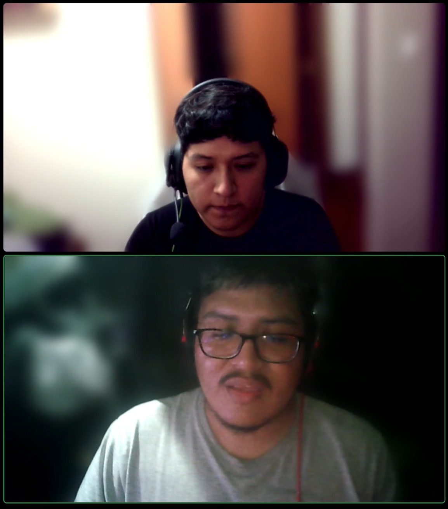
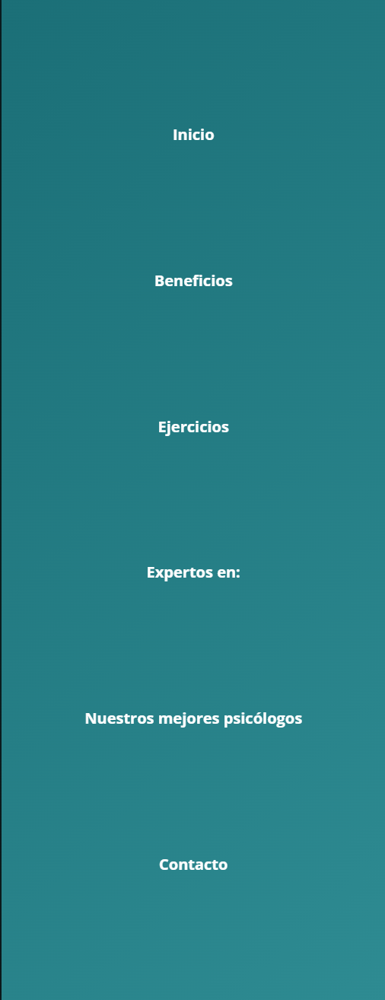
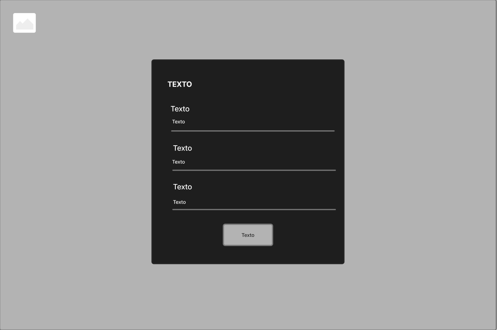
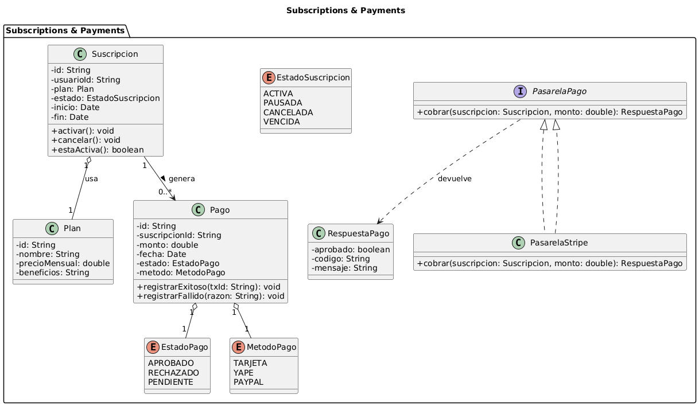
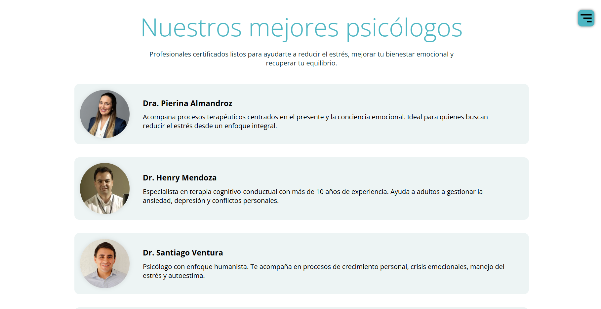

# Informe del Trabajo Final

  

  
<b>Informe de Trabajo Final</b>

  
Facultad de Ingeniería

  
Universidad Peruana de Ciencias Aplicadas

  
Ingeniería de Software

  
Desarrollo de Aplicaciones Open Source - 1ASI0729

  
NRC: 7351

  
Profesor: Rafael Oswaldo Castro Veramendi

  
Startup: NeuroDora

  
Producto: MinDora

---

## Team members:

| **Nombre**                         | **Código** |
| ---------------------------------- | ---------- |
| Manuel Fernando, Joao Castro Picón | U20231G159 |
| Sebastián De Las Casas Latour      | U202213553 |
| Eduardo Fabián Chacaliaza Minaya   | U202324129 |
| Fabricio Fabián Quispe Barzola     | U202320442 |
| Juan Jose Meza Huanacune           | U202320574 |

  
<b>Ciclo 2025 - 2</b>

  
<b>Septiembre 2025</b>

---

## Registro de Versiones del Informe

El objetivo de esta sección es resumir las modificaciones relevantes que se realizan al informe durante el ciclo de vida del proyecto.  

| *Versión* | *Fecha*   | *Autor*                           | *Descripción de modificación*                                                                 |
|-------------|-------------|-------------------------------------|-------------------------------------------------------------------------------------------------|
| 1.0         | 2025-09-10  | Manuel Castro                       | Creación inicial del documento: carátula, índice preliminar y Student Outcome (TB1).            |
| 1.1         | 2025-09-12  | Sebastián De Las Casas              | Se añadió Introducción: Startup Profile y Solution Profile (antecedentes, problemática, Lean UX).|
| 1.2         | 2025-09-14  | Eduardo Chacaliaza                  | Se incorporó Segmentos Objetivos y análisis competitivo de competidores (Calm, Wysa, Equoo).   |
| 1.3         | 2025-09-16  | Fabricio Quispe                     | Se agregó diseño y registro de entrevistas (segmentos 1 y 2) con sus respectivos resúmenes.    |
| 1.4         | 2025-09-17  | Juan José Meza                      | Inclusión de Needfinding: User Personas, Journey Mapping y Empathy Map.                        |
| 1.5         | 2025-09-18  | Equipo completo                     | Desarrollo de User Stories con Epics, criterios de aceptación y armado del Product Backlog.    |
| 1.6         | 2025-09-19  | Manuel Castro & Eduardo Chacaliaza  | Se documentó el Big Picture Event Storming con capturas y explicación del proceso.             |
| 1.7         | 2025-09-20  | Sebastián De Las Casas & Fabricio Quispe | Se añadió Style Guidelines (tipografía, colores, íconos) y primeras secciones de Product Design.|

## Project Report Collaboration Insights  

El equipo ha trabajado de manera colaborativa en el repositorio de GitHub, registrando avances constantes en la construcción del informe.  
Repositorio del informe: https://github.com/UPC-1ASI0729-2520-7351-Mindora/project-report

A continuación, se presentan las evidencias de participación y colaboración de los integrantes:  

- Cada integrante del grupo realizó commits, modificaciones y carga de archivos en distintas secciones del informe.  
- Se refleja la división de tareas entre redacción, correcciones de estilo, incorporación de imágenes y ajustes técnicos en Markdown.  
- Todos los miembros participaron en mayor o menor medida, garantizando que el documento evolucionara de forma colaborativa y transparente.  
- La evidencia gráfica incluye la vista de contribuciones, así como el historial de actividad donde se observa el detalle de commits y cambios en el repositorio.  

### Contribuciones por integrante  

  

  

En esta vista se observa la cantidad de commits realizados, junto con el balance de líneas añadidas y eliminadas.  

### Historial de actividad del repositorio  

  

  

  

  

---

En conjunto, las capturas reflejan el cumplimiento de los objetivos de colaboración: **participación activa de todos los integrantes**, registro claro de los aportes, y una evolución continua y transparente del informe del proyecto.  

# Contenido

1. [Capítulo I: Introducción](#1-capítulo-i-introducción)  
   1.1. [Startup Profile](#11-startup-profile)  
      1.1.1. [Descripción del startup](#111-descripción-del-startup)  
      1.1.2. [Perfiles de los integrantes del equipo](#112-perfiles-de-los-integrantes-del-equipo)  
   1.2. [Solution Profile](#12-solution-profile)  
      1.2.1. [Antecedentes y Problemática](#121-antecedentes-y-problemática)  
      1.2.2. [Lean UX Process](#122-lean-ux-process)  
         1.2.2.1. [Lean UX Problem Statement](#1221-lean-ux-problem-statement)  
         1.2.2.2. [Lean UX Assumptions](#1222-lean-ux-assumptions)  
         1.2.2.3. [Lean UX Hypothesis Statements](#1223-lean-ux-hypothesis-statements)  
         1.2.2.4. [Lean UX Canvas](#1224-lean-ux-canvas)  
   1.3. [Segmentos objetivos](#13-segmentos-objetivos)

2. [Capítulo II: Requirements Elicitation & Analysis](#2-capítulo-ii-requirements-elicitation--analysis)  
   2.1. [Competidores](#21-competidores)  
      2.1.1. [Análisis competitivo](#211-análisis-competitivo)  
      2.1.2. [Estrategias y tácticas frente a competidores](#212-estrategias-y-tácticas-frente-a-competidores)  
   2.2. [Entrevistas](#22-entrevistas)  
      2.2.1. [Diseño de entrevistas](#221-diseño-de-entrevistas)  
      2.2.2. [Registro de entrevistas](#222-registro-de-entrevistas)  
      2.2.3. [Análisis de entrevistas](#223-análisis-de-entrevistas)  
   2.3. [Needfinding](#23-needfinding)  
      2.3.1. [User Personas](#231-user-personas)  
      2.3.2. [User Task Matrix](#232-user-task-matrix)  
      2.3.3. [User Journey Mapping](#233-user-journey-mapping)  
      2.3.4. [Empathy Mapping](#234-empathy-mapping)  
   2.4. [Ubiquitous Language](#24-ubiquitous-language)

3. [Capítulo III: Requirements Specification](#3-capítulo-iii-requirements-specification)  
   3.1. [To-Be Scenario Mapping](#31-to-be-scenario-mapping)  
   3.2. [User Stories](#32-user-stories)  
   3.3. [Impact Mapping](#33-impact-mapping)  
   3.4. [Product Backlog](#34-product-backlog)

4. [Capítulo IV: Product Design](#4-capítulo-iv-product-design)  
   4.1. [Style Guidelines](#41-style-guidelines)  
      4.1.1. [General Style Guidelines](#411-general-style-guidelines)  
      4.1.2. [Web Style Guidelines](#412-web-style-guidelines)  
   4.2. [Information Architecture](#42-information-architecture)  
      4.2.1. [Organization Systems](#421-organization-systems)  
      4.2.2. [Labeling Systems](#422-labeling-systems)  
      4.2.3. [SEO Tags and Meta Tags](#423-seo-tags-and-meta-tags)  
      4.2.4. [Searching Systems](#424-searching-systems)  
      4.2.5. [Navigation Systems](#425-navigation-systems)  
   4.3. [Landing Page UI Design](#43-landing-page-ui-design)  
      4.3.1. [Landing Page Wireframe](#431-landing-page-wireframe)  
      4.3.2. [Landing Page Mock-up](#432-landing-page-mock-up)  
   4.4. [Web Applications UX/UI Design](#44-web-applications-uxui-design)  
      4.4.1. [Web Applications Wireframes](#441-web-applications-wireframes)  
      4.4.2. [Web Applications Wireflow Diagrams](#442-web-applications-wireflow-diagrams)  
      4.4.3. [Web Applications Mock-ups](#443-web-applications-mock-ups)  
      4.4.4. [Web Applications User Flow Diagrams](#444-web-applications-user-flow-diagrams)  
   4.5. [Web Applications Prototyping](#45-web-applications-prototyping)  
   4.6. [Domain-Driven Software Architecture](#46-domain-driven-software-architecture)       
      4.6.1. [Design-Level Event Storming](#461-design-level-event-storming)     
      4.6.2. [Software Architecture Context Diagram](#462-software-architecture-context-diagram)      
      4.6.3. [Software Architecture Container Diagrams](#463-software-architecture-container-diagrams)      
      4.6.4. [Software Architecture Components Diagrams](#464-software-architecture-components-diagrams)      
   4.7. [Software Object-Oriented Design](#47-software-object-oriented-design)    
      4.7.1. [Class Diagrams](#471-class-diagrams)  
   4.8. [Database Design](#48-database-design)  
      4.8.1. [Database Diagram](#481-database-diagram)

5. [Capítulo V: Product Implementation, Validation & Deployment](#5-capítulo-v-product-implementation-validation--deployment)  
   5.1. [Software Configuration Management](#51-software-configuration-management)  
      5.1.1. [Software Development Environment Configuration](#511-software-development-environment-configuration)  
      5.1.2. [Source Code Management](#512-source-code-management)  
      5.1.3. [Source Code Style Guide & Conventions](#513-source-code-style-guide--conventions)  
      5.1.4. [Software Deployment Configuration](#514-software-deployment-configuration)  
   5.2. [Landing Page, Services & Applications Implementation](#52-landing-page-services--applications-implementation)  
      5.2.1. [Sprint 1](#521-sprint-1)  
         5.2.1.1. [Sprint Planning 1](#5211-sprint-planning-1)  
         5.2.1.2. [Aspect Leaders and Collaborators](#5212-aspect-leaders-and-collaborators)  
         5.2.1.3. [Sprint Backlog 1](#5213-sprint-backlog-1)  
         5.2.1.4. [Development Evidence for Sprint Review](#5214-development-evidence-for-sprint-review)  
         5.2.1.5. [Execution Evidence for Sprint Review](#5215-execution-evidence-for-sprint-review)  
         5.2.1.6. [Services Documentation Evidence for Sprint Review](#5216-services-documentation-evidence-for-sprint-review)  
         5.2.1.7. [Software Deployment Evidence for Sprint Review](#5217-software-deployment-evidence-for-sprint-review)  
         5.2.1.8. [Team Collaboration Insights during Sprint](#5218-team-collaboration-insights-during-sprint)  
   5.3. [Validation Interviews](#53-validation-interviews)  
      5.3.1. [Diseño de Entrevistas](#531-diseño-de-entrevistas)  
      5.3.2. [Registro de Entrevistas](#532-registro-de-entrevistas)  
      5.3.3. [Evaluaciones según heurísticas](#533-evaluaciones-según-heurísticas)  
   5.4. [Video About-the-Product](#54-video-about-the-product)

6. [Conclusiones](#6-conclusiones)  
   6.1. [Conclusiones](#61-conclusiones)  
   6.2. [Recomendaciones](#62-recomendaciones)

7. [Bibliografía](#7-bibliografía)

8. [Anexos](#8-anexos)

---
# Student Outcome

El curso contribuye al cumplimiento del **Student Outcome ABET – EAC – Outcome 3**  

**Criterio:** Capacidad de comunicarse efectivamente con un rango de audiencias.

En el siguiente cuadro se describen las acciones realizadas y enunciados de conclusiones por parte del grupo, que permiten sustentar el haber alcanzado el logro del ABET – EAC – Student Outcome 3.

---

## Cuadro de Student Outcome 3 – Comunicación efectiva (TB1)

| **Criterio específico** | **Acciones realizadas (TB1)** | **Conclusiones (TB1)** |
|-------------------------|-------------------------------|-------------------------|
| **Comunica oralmente con efectividad a diferentes rangos de audiencia** | - *Manuel Castro*: Participó en la presentación oral del **Startup Profile** en la exposición grabada de TB1. - *Sebastián De Las Casa*: Expuso la introducción y objetivos del proyecto en la presentación grupal. - *Eduardo Chacaliaza*: Explicó el apartado de **Solution Profile** durante la exposición. - *Fabricio Quispe*: Presentó la problemática y segmentos objetivos. - *Juan Meza*: Colaboró en la sustentación de la parte metodológica. | Como grupo logramos estructurar y presentar de forma oral los fundamentos iniciales del proyecto, repartiendo roles y asegurando que cada integrante comunicara claramente su parte a la audiencia. |
| **Comunica por escrito con efectividad a diferentes rangos de audiencia** | - *Manuel Castro*: Redacción de la **carátula** y parte de la descripción del startup. - *Sebastián De Las Casa*: Contribuyó en el **índice de contenidos** y organización del documento. - *Eduardo Chacaliaza*: Coordinó la escritura en **Markdown** y la conversión a PDF. - *Fabricio Quispe*: Redactó los apartados de antecedentes y problemática. - *Juan Meza*: Revisó ortografía y estilo en el Student Outcome. | A través de la redacción colaborativa en Markdown, logramos elaborar un informe inicial claro y coherente, demostrando la capacidad de comunicar ideas técnicas y conceptuales por escrito a una audiencia académica. |

---
# 1. Capítulo I: Introducción

## 1.1. Startup Profile

### 1.1.1. Descripción de la Startup

Nuestro startup llamado NeuroDora está enfocado en la rápida detección y apoyo en el tratamiento del estrés en el ámbito laboral de personas entre 20 y 50 años de edad. La solución aborda temas relacionados con la salud mental, la presión laboral y la necesidad de contar con servicios accesibles y confiables para mejorar el bienestar de los trabajadores.  

A través de un test interactivo, la plataforma recopila información sobre el estado de salud, el comportamiento, las actitudes y los patrones de cada usuario, identificando tempranamente señales de estrés. Con base en estos resultados, el sistema facilita el contacto directo con un psicólogo especializado y ofrece diversas actividades de apoyo para complementar el tratamiento y la gestión del estrés.  

NeuroDora se proyecta como un modelo de negocio independiente y sostenible, ofreciendo un esquema de suscripción para usuarios individuales y convenios con empresas interesadas en promover la salud mental de sus colaboradores. De esta manera, el proyecto combina la tecnología con un enfoque de impacto social positivo, contribuyendo a mejorar la calidad de vida en el entorno laboral.

### 1.1.2. Perfiles de los integrantes del equipo

| Foto | Nombres y Apellidos | Código | Carrera | Descripción |
|------|---------------------|--------|---------|-------------|
|  | Manuel Fernando Joao Castro Picón | U20231G159 | Ingeniería de Software | Posee conocimientos en programación con Java y bases de datos, además de experiencia en buenas prácticas de desarrollo. Aporta en la construcción de la lógica de negocio y en el soporte técnico del proyecto. |
|  | Sebastián De Las Casa Latour | U202213553 | Ingeniería de Software | Tiene habilidades en programación web y diseño de software, con interés en el aprendizaje de nuevas tecnologías. Contribuye en la implementación de interfaces y en la mejora de la experiencia de usuario. |
|  | Eduardo Fabian Chacaliaza Minaya | U202324129 | Ingeniería de Software | Se enfoca en el desarrollo frontend y la creación de interfaces intuitivas y accesibles. Maneja herramientas de control de versiones y trabajo colaborativo en GitHub, aportando organización y documentación técnica al equipo. |
|  | Fabricio Fabián Quispe Barzola | U202320442 | Ingeniería de Software | Cuenta con experiencia en prototipado en Figma, validación de ideas y análisis de datos. Aporta en la investigación de usuarios y en la elaboración de artefactos de UX que guían el desarrollo del proyecto. |
|  | Juan José Meza Huanacune | U202320574 | Ingeniería de Software | Tiene experiencia en desarrollo backend con Java, C# y Python, además de bases de datos relacionales. También posee conocimientos en pruebas de software, contribuyendo a la calidad del sistema y al desarrollo de componentes del proyecto. |

## 1.2. Solution Profile

### 1.2.1. Antecedentes y problemática

El estrés laboral es reconocido como uno de los principales problemas que afectan a la población económicamente activa, impactando tanto en la salud mental y física de los trabajadores como en la productividad de las organizaciones. En particular, los adultos entre 20 y 50 años son el grupo más vulnerable, ya que se encuentran en plena etapa laboral, expuestos a altos niveles de exigencia, presión por resultados y prolongadas jornadas de trabajo.  

La problemática identificada es la falta de herramientas accesibles y efectivas que permitan a las personas detectar de manera temprana sus niveles de estrés y recibir orientación práctica para gestionarlo. En muchos casos, los trabajadores no cuentan con mecanismos de autoevaluación ni con recomendaciones inmediatas que puedan aplicar en su día a día, lo cual incrementa el riesgo de desarrollar problemas de salud asociados al estrés crónico.  

El proyecto mindora surge como respuesta a esta necesidad. La propuesta consiste en desarrollar un sistema de identificación y gestión del estrés laboral mediante la observación y registro de señales corporales visibles como postura, tensión muscular facial, cambios en la respiración, sudoración, temblores o rojeces en la piel. Estos datos se integran en una aplicación que permite a los usuarios autoevaluar sus niveles de estrés, recibir recomendaciones personalizadas y acceder a estrategias prácticas de manejo, contribuyendo así a mejorar el bienestar de los trabajadores y la productividad organizacional.

#### 1.2.1.1. What  

*¿Cuál es el problema?*  
El estrés laboral afecta negativamente la salud física y mental de los trabajadores adultos, reduciendo su productividad, aumentando el ausentismo y deteriorando su calidad de vida.  

*¿Cuál es la relación con la persona en cuestión?*  
La relación es directa, ya que el sistema permitirá a los usuarios identificar sus niveles de estrés mediante señales corporales observables y técnicas de respiración, facilitando la adopción de medidas preventivas y correctivas oportunas.  

---

#### 1.2.1.2. Who  

*¿Quiénes están involucrados?*  
Los trabajadores adultos de 20 a 50 años, así como las empresas interesadas en mejorar la salud ocupacional de sus empleados.  

*¿A quiénes les sucede el problema?*  
A profesionales en edad productiva que enfrentan presión laboral, especialmente en sectores con altas exigencias, responsabilidades o ambientes competitivos.  

*¿Quién lo utilizará?*  
Adultos entre 20 y 50 años con acceso a dispositivos móviles, interesados en monitorear y gestionar su estrés de forma proactiva.  

---

#### 1.2.1.3. Where  

*¿Dónde está el cliente cuando usa el producto?*  
Principalmente en su entorno laboral: oficinas, teletrabajo desde casa o espacios donde realice su actividad profesional.  

*¿A dónde se dirige?*  
Hacia un estado de mayor autoconocimiento y manejo del estrés, con el objetivo de mejorar su bienestar y calidad de vida laboral.  

*¿Dónde surge el problema?*  
En el entorno laboral, donde la carga de trabajo, las relaciones interpersonales y el clima organizacional generan situaciones de tensión.  

---

#### 1.2.1.4. When  

*¿Cuándo sucede el problema?*  
Durante la jornada laboral, en momentos de alta presión, plazos ajustados, conflictos interpersonales, sobrecarga de trabajo o desequilibrio entre exigencias y recursos disponibles.  

*¿Cuándo utiliza el cliente el producto?*  
Durante el trabajo, en evaluaciones programadas o cuando perciba síntomas de tensión.  

---

#### 1.2.1.5. Why  

*¿Cuál es la causa del problema?*  
Altas exigencias laborales, recursos insuficientes, inseguridad laboral, conflictos interpersonales, desequilibrio entre vida personal y profesional, falta de control sobre las tareas y ausencia de herramientas efectivas para detectar y gestionar el estrés tempranamente.  

---

#### 1.2.1.6. How  

*¿En qué condiciones los clientes usan el producto?*  
En momentos de calma para establecer una línea base, en situaciones de tensión para recibir orientación inmediata y como herramienta de seguimiento diario.  

*¿Cómo nos conocieron los compradores?*  
A través de campañas digitales, recomendaciones de profesionales de salud ocupacional, programas corporativos de bienestar y marketing en plataformas utilizadas por profesionales.  

*¿Cómo prefieren acceder al contenido?*  
Mediante una aplicación móvil intuitiva, con notificaciones personalizadas, panel visual simple y recomendaciones prácticas fáciles de aplicar.  

*¿Qué los llevó a esta situación?*  
Una combinación de factores externos (presión laboral, clima organizacional) e internos (hábitos personales, estrategias de afrontamiento), junto con la falta de herramientas para gestionar el estrés de manera preventiva.  

---

#### 1.2.1.7. How much  

Según un estudio en seis países de Latinoamérica, hasta el 63% de los trabajadores sufre estrés laboral, especialmente mujeres (Mejía, 2019). De acuerdo con la Organización Mundial de la Salud (2020), el estrés laboral es una de las principales causas de ausentismo y disminución de productividad en la población activa, además de aumentar el riesgo de enfermedades físicas y mentales. Este impacto genera altos costos tanto en salud pública como en la calidad de vida de los trabajadores.

### 1.2.2. Lean UX Process

#### 1.2.2.1. Lean UX Problem Statement

Nuestra aplicación busca ayudar a los trabajadores a identificar y gestionar su estrés laboral a través de un test de autoevaluación y la observación de señales físicas como la postura, la respiración y la tensión facial. Asimismo, ofrece acceso a psicólogos y actividades prácticas orientadas a mejorar el bienestar.  

Hemos observado que un gran número de adultos entre 20 y 50 años experimenta niveles elevados de estrés en sus entornos laborales, pero carece de herramientas simples, accesibles y efectivas que les permitan reconocer estos niveles a tiempo y actuar de manera adecuada.  

**Pregunta guía:**  
¿Cómo podemos facilitar que los trabajadores detecten y manejen su estrés de forma temprana y efectiva en su entorno laboral, mediante una solución accesible, intuitiva y que se integre en su rutina diaria?

#### 1.2.2.2. Lean UX Assumptions

**Feature:** Sistema de identificación y gestión del estrés laboral en mindora  

**Registro biométrico y perfil del usuario**  
Creemos que nuestros usuarios, adultos de 20 a 50 años en el ámbito laboral, necesitan una forma sencilla y segura de registrar sus parámetros biométricos (a través de la cámara o sensores de sus dispositivos móviles), junto con información de salud y comportamiento. Esto permitirá personalizar el seguimiento y la gestión del estrés en función de las características individuales.  

**Detección temprana de estrés mediante patrones físicos**  
Creemos que la identificación de señales biométricas observables (postura, tensión muscular, patrones de respiración y sudoración) permitirá detectar de forma temprana niveles de estrés. Esto facilitará la intervención oportuna antes de que los síntomas se agraven, impactando positivamente en la salud mental y física de los usuarios.  

**Integración de evaluaciones psicológicas y recomendaciones personalizadas**  
Creemos que los usuarios se beneficiarán al combinar la autoevaluación biométrica con tests emocionales y recomendaciones personalizadas (ejercicios de respiración, pausas activas y contacto con especialistas). Esta integración permitirá conocer el estado en tiempo real y acceder a soluciones prácticas adaptadas a su contexto.  

**Seguimiento y análisis de datos de estrés**  
Creemos que disponer de un registro histórico del nivel de estrés y obtener estadísticas personalizadas ayudará a los usuarios a identificar patrones y cambios en su salud, promoviendo acciones preventivas y mejoras en su entorno laboral y personal.  

**Business outcomes (resultados del negocio)**  
- Aumentar la productividad laboral y reducir el ausentismo, ya que los trabajadores podrán identificar y gestionar su estrés de manera proactiva.  
- Generar ingresos a través de planes de suscripción individuales y acuerdos corporativos con empresas interesadas en el bienestar de sus empleados.  
- Posicionar a mindora como una herramienta innovadora y confiable para la salud mental en el ámbito laboral, ampliando su alcance en el mercado latinoamericano.  

**Users (usuarios)**  
- Profesionales y empleados de 20 a 50 años que desarrollan sus actividades en ambientes laborales exigentes y de alta presión.  
- Personas que desean mejorar su bienestar integral mediante el monitoreo de señales físicas y emocionales.  
- Usuarios que utilizan dispositivos móviles y buscan soluciones digitales para la autogestión de su salud mental.  

**User outcomes (beneficios para el usuario)**  
- Identificar sus niveles de estrés de manera temprana y objetiva mediante el análisis de patrones biométricos.  
- Acceder a recomendaciones personalizadas que les ayuden a manejar y reducir los síntomas de estrés.  
- Visualizar estadísticas y tendencias de su bienestar, facilitando el seguimiento en el tiempo.  
- Mejorar su calidad de vida laboral y personal gracias a estrategias adaptadas a sus necesidades específicas.  

**Features (características de la solución)**  
- Registro de datos biométricos a través de la cámara y sensores del dispositivo móvil.  
- Autoevaluación integral que combine aspectos emocionales y físicos del estrés.  
- Recomendaciones personalizadas de ejercicios, pausas activas y consejos de salud mental basados en el perfil del usuario.  
- Historial y dashboard interactivo que muestre evolución, tendencias y alertas de niveles de estrés.  
- Integración con profesionales de la salud mental y bienestar para intervenciones personalizadas.

#### 1.2.2.3. Lean UX Hypothesis Statements

**Hypothesis Statement 01**  
**Creemos** que la implementación de un sistema de registro biométrico y autoevaluación permitirá a los usuarios identificar tempranamente sus niveles de estrés laboral.  
**Sabemos** que esta hipótesis es cierta cuando se observe una correlación significativa entre los datos biométricos capturados y las autoevaluaciones realizadas por los usuarios.  
**Cuando** al menos el 65% de los usuarios complete de forma regular las evaluaciones en la plataforma y se detecten cambios relevantes en sus patrones biométricos.  

---

**Hypothesis Statement 02**  
**Creemos** que al ofrecer recomendaciones personalizadas basadas en el análisis del estrés, los usuarios adoptarán prácticas de autogestión más efectivas para reducir sus síntomas.  
**Sabemos** que esta hipótesis es cierta cuando los usuarios reporten mejoras en su bienestar y se registre una disminución en los indicadores de estrés durante los seguimientos periódicos.  
**Cuando** se logre una reducción del 20% en la frecuencia e intensidad de síntomas reportados en los primeros seis meses de uso.  

---

**Hypothesis Statement 03**  
**Creemos** que la visualización de un historial interactivo y tendencias de estrés motivará a los usuarios a llevar un control continuo de su salud mental.  
**Sabemos** que esta hipótesis es cierta cuando se registre un aumento en la interacción con el dashboard y una mayor adherencia a las recomendaciones sugeridas.  
**Cuando** el uso constante de las herramientas de seguimiento genere datos que indiquen una mayor consciencia y un manejo más proactivo del estrés en el entorno laboral.

#### 1.2.2.4. Lean UX Canvas

El Lean UX Canvas es una de las herramientas empleadas para comprender mejor a los posibles usuarios y sus necesidades. Esta técnica, propia del diseño centrado en el usuario y de la metodología Lean, permite estructurar de manera clara el problema, las hipótesis y los resultados esperados. Además, facilita el trabajo colaborativo en equipos multidisciplinarios, asegurando que el desarrollo del producto se realice de forma eficiente y orientada a generar valor para los usuarios.  

  

## 1.3. Segmentos Objetivos

#### Segmento objetivo #1: Trabajadores formales con jornadas extensas  

Este segmento está compuesto por personas que cumplen horarios laborales prolongados, generalmente mayores a 8 horas diarias, y que enfrentan altos niveles de presión psicológica en su entorno profesional. La sobrecarga de trabajo y la falta de límites claros entre lo personal y lo laboral generan cuadros de estrés que afectan su rendimiento y calidad de vida. Según estudios realizados en distintos sectores, alrededor del 70% de los trabajadores presenta síntomas de estrés agudo en sus actividades cotidianas (Estudio LATAM, 2020). Este grupo constituye un eje clave para el éxito de la plataforma, al ser los principales beneficiarios de las capacidades que propone MinDora.  

#### Segmento objetivo #2: Trabajadores informales o con horarios flexibles  

Este segmento está compuesto por adultos que no necesariamente forman parte del empleo formal y cuyas actividades se desarrollan sin horarios fijos. A menudo, experimentan mayores niveles de estrés debido a la disponibilidad permanente que exige su trabajo, la inestabilidad económica y la dificultad para establecer límites entre la vida laboral y personal. Un estudio realizado a 250 trabajadores informales muestra que el 56% presenta un nivel medio de estrés, el 33.3% un nivel bajo y el 10.6% un nivel alto (Porcayo, 2022). Este grupo también se beneficiará de la plataforma, destacando su potencial para ampliar el alcance del producto en contextos laborales diversos y cada vez más comunes.  

# 2. Capítulo II: Requirements Elicitation & Analysis

---

## 2.1. Competidores  

El análisis de competidores permite identificar las fortalezas, limitaciones y propuestas de valor de aplicaciones ya posicionadas en el mercado de la salud mental y el manejo del estrés. Para este estudio se seleccionaron tres referentes internacionales: Calm, Wysa y Equoo. Estas plataformas fueron escogidas por su alcance global, sus diferentes enfoques metodológicos (multimedia, inteligencia artificial y gamificación) y su relevancia en la atención de problemas relacionados con el estrés, la ansiedad y el bienestar emocional.  

| Competidores | Características | Diferencias | Limitaciones |
| ------------ | --------------- | ----------- | ------------ |
| 
 Calm
 | - Ejercicios de respiración y programas diarios de 10 minutos. - Meditaciones guiadas y rutinas físicas para la relajación. - Historias en audiolibro para mejorar el sueño. - Contenido audiovisual de alta calidad. | - Enfoque multimedia con audios narrados por celebridades y música profesional. - Contenido segmentado según necesidades específicas (estrés, sueño, concentración). | - Gran parte del contenido es de pago. - No ofrece personalización avanzada. - Carece de controles para usuarios más jóvenes. |
| 
 Wysa
 | - Chatbot conversacional impulsado por inteligencia artificial. - Ejercicios de respiración, relajación y meditación. - Interacciones anónimas y privadas. - Plan premium con acceso a terapeutas profesionales. | - Experiencia conversacional con IA (a diferencia de Calm con audio y Equoo con juegos). - Uso de técnicas terapéuticas validadas (CBT, DBT). - Modelo freemium (chatbot gratuito + pago por coaching). | - No puede atender emergencias de salud mental. - Limitaciones técnicas en la comprensión de matices emocionales complejos. - Efectividad depende de la constancia del usuario. |
| 
 Equoo
 | - Terapia Cognitiva Conductual y psicología positiva aplicada a un entorno gamificado. - Juego con 52 niveles que fomentan habilidades emocionales. - Chatbot de apoyo en paralelo. - Respaldo en estudios clínicos. | - Experiencia centrada en la gamificación con misiones y recompensas. - Orientación a jóvenes mediante narrativa lúdica. - Estadísticas y progresión tipo “nivel”, ausentes en Calm y Wysa. | - Variedad limitada de juegos emocionales. - Enfoque lúdico que puede no ajustarse a usuarios que prefieren métodos más tradicionales. - Dependencia del formato de juego. |

**Conclusión:**  
El análisis evidencia que, aunque existen aplicaciones exitosas en la gestión del estrés, cada una presenta limitaciones que abren oportunidades para MinDora. Calm destaca por su producción multimedia, pero carece de personalización biométrica; Wysa ofrece acompañamiento conversacional, pero con limitaciones técnicas y sin cobertura de crisis; Equoo innova con gamificación, aunque con un alcance restringido. MinDora busca diferenciarse al integrar detección biométrica, autoevaluaciones emocionales y acceso a especialistas, ofreciendo un enfoque más completo y adaptable a distintos contextos laborales, especialmente en Latinoamérica.

### 2.1.1. Análisis competitivo  

El análisis competitivo se organiza siguiendo el formato *Competitive Analysis Landscape*, lo que permite comparar a MinDora frente a tres competidores relevantes: **Calm**, **Wysa** y **Equoo**.  

| Criterio | 
 MinDora
 | 
 Calm
 | 
 Wysa
 | 
 Equoo
 |
| :-- | :-- | :-- | :-- | :-- |
| **Perfil – Overview** | Plataforma digital que detecta y gestiona el estrés laboral en adultos de 20 a 50 años mediante biometría, autoevaluación y contacto con psicólogos. | Aplicación de bienestar mental para relajarse, dormir mejor y reducir el estrés. Ofrece meditaciones, historias para dormir, música y ejercicios de respiración. | Asistente de bienestar emocional basado en IA, con CBT, DBT, journaling y meditaciones disponibles 24/7. | App gamificada que desarrolla inteligencia emocional mediante juegos interactivos basados en psicología. |
| **Perfil – Ventaja competitiva** | Integración de biometría, autoevaluaciones y apoyo profesional en un solo sistema accesible en Latinoamérica. | Diversidad de opciones de relajación; alta calidad de producción multimedia. | Chatbot disponible 24/7 con técnicas terapéuticas validadas y coaching humano opcional. | Combina entretenimiento con técnicas psicológicas, aumentando la adherencia y compromiso. |
| **Perfil de Marketing – Mercado objetivo** | Adultos de 20 a 50 años en entornos laborales formales e informales con altos niveles de estrés. | Adultos entre 30 y 35 años con ingresos medio-altos que puedan pagar una suscripción. | Adultos jóvenes (18-35) y empresas que buscan salud mental accesible 24/7. | Adultos jóvenes (18-35), profesionales estresados, empresas e instituciones educativas. |
| **Perfil de Marketing – Estrategias de marketing** | Marketing digital en redes sociales, convenios con empresas y programas de salud ocupacional. | Modelo freemium, marketing con celebridades y alianzas con empresas. | Marketing de contenidos, alianzas B2B y ASO con campañas en Instagram y LinkedIn. | Contenido educativo, partnerships B2B, campañas en redes sociales y pruebas gratuitas. |
| **Perfil de Producto – Productos & Servicios** | Autoevaluaciones biométricas, tests emocionales, recomendaciones personalizadas, historial de estrés, acceso a especialistas. | Meditaciones guiadas, historias para dormir, música relajante, ejercicios de respiración, clases de movimientos. | Chatbot gratuito con CBT/DBT y “pathways” temáticos; sesiones premium con coaches humanos. | App de entrenamiento emocional, versión empresarial y evaluaciones personalizadas. |
| **Perfil de Producto – Precios & Costos** | Modelo freemium; suscripción mensual accesible y planes corporativos flexibles. | Freemium; plan mensual 15 USD, anual 70 USD, familiar 100 USD, de por vida 400 USD. | Freemium; plan mensual 12 USD, anual 19 USD; tarifas corporativas variables. | Freemium; plan individual 5-10 USD/mes, planes corporativos por volumen. |
| **Perfil de Producto – Canales de distribución** | App móvil (iOS/Android); plataforma web; convenios corporativos. | App móvil (iOS/Android); plataforma web para empresas y coaching. | App móvil (iOS/Android); plataforma web para empresas y coaching. | Apps móviles (iOS/Android); plataforma web; integración con sistemas corporativos. |
| **Análisis SWOT – Fortalezas** | Enfoque innovador basado en biometría, autoevaluación y contacto profesional; orientado al contexto latinoamericano. | Disponible 24/7, diversidad de opciones en la aplicación. | Disponible 24/7, técnicas terapéuticas validadas e interfaz intuitiva. | Base científica sólida, formato atractivo, enfoque preventivo. |
| **Análisis SWOT – Debilidades** | Necesidad de alta precisión en biometría y confianza en la privacidad de datos. | Precio elevado, no ofrece sesiones en vivo, enfoque principal en angloparlantes. | No reemplaza terapia presencial, contenido gratuito limitado, calidad dependiente de la IA. | Alta competencia, creación continua de contenido, percepción de ser una solución “ligera”. |
| **Análisis SWOT – Oportunidades** | Creciente interés en salud mental laboral en LATAM; alianzas con empresas y programas de bienestar corporativo. | Expansión internacional, integración con servicios de salud mental profesional. | Expansión en nuevos mercados, alianzas con telemedicina y wearables, localización cultural. | Creciente interés en salud mental, expansión internacional, integraciones tecnológicas. |
| **Análisis SWOT – Amenazas** | Competencia global consolidada; barreras de confianza en adopción de soluciones digitales en salud mental. | Competencia intensa, precios más asequibles en otras apps. | Competencia intensa, regulaciones de salud digital, preocupaciones por privacidad de datos. | Saturación del mercado, cambios en políticas de privacidad, escepticismo sobre la eficacia digital. |

## 2.1.2. Estrategias y tácticas frente a competidores  

Las estrategias y tácticas de MinDora se construyen tomando como base el análisis SWOT presentado en la tabla comparativa. A continuación, se detallan las combinaciones FO, DO, FA y DA que permitirán aprovechar las oportunidades del mercado, reforzar nuestras fortalezas y mitigar tanto debilidades como amenazas frente a la competencia.  

### Estrategias FO (Fortalezas + Oportunidades)  
- Gracias a nuestro **enfoque innovador en biometría y autoevaluación (F)** y al **creciente interés en la salud mental laboral en LATAM (O)**, desarrollaremos programas de bienestar corporativo que integren evaluaciones biométricas y talleres de sensibilización en empresas.  
- Con nuestra **conexión con especialistas (F)** y el **interés de aseguradoras y áreas de RR.HH. en métricas de bienestar (O)**, diseñaremos planes empresariales que incluyan reportes agregados y anónimos para demostrar impacto en la reducción del ausentismo y mejora de la productividad.  

### Estrategias DO (Debilidades + Oportunidades)  
- Para enfrentar la **necesidad de precisión en biometría (D)** y aprovechar la **aceptación social creciente de plataformas digitales de salud (O)**, realizaremos pruebas piloto validadas por universidades locales que respalden científicamente la fiabilidad del sistema.  
- Considerando la **confianza limitada de algunos usuarios en compartir datos (D)** y el **interés de las empresas en programas de bienestar (O)**, ofreceremos versiones de la aplicación con niveles diferenciados de privacidad y personalización, acompañadas de capacitaciones en salud mental.  

### Estrategias FA (Fortalezas + Amenazas)  
- Frente a la **competencia global consolidada (A)**, resaltaremos nuestra **orientación al mercado latinoamericano y la integración de biometría, autoevaluaciones y conexión con psicólogos (F)** como un diferencial que responde a un contexto cultural específico.  
- Para contrarrestar las **preocupaciones sobre confidencialidad de datos (A)**, aprovecharemos nuestro **foco regional y alianzas con especialistas (F)** para implementar un sello de certificación en privacidad que fortalezca la confianza de los usuarios.  

### Estrategias DA (Debilidades + Amenazas)  
- Ante la **competencia intensa y la percepción de nuevas apps como “ligeras” (A)** y nuestro **limitado reconocimiento global (D)**, iniciaremos campañas locales en LATAM que muestren casos de éxito medibles antes de expandirnos internacionalmente.  
- Para mitigar los **riesgos regulatorios sobre el uso de datos de salud (A)** y la **debilidad asociada a la confianza en biometría (D)**, estableceremos auditorías externas y alianzas con organismos de salud que avalen la transparencia y seguridad del sistema. 

---

## 2.2.1. Diseño de entrevistas.

## Segmento 1: Trabajadores formales con jornadas extensas

Para evaluar las necesidades y experiencias de profesionales con horarios laborales extensos que
enfrentan altos niveles de estrés, hemos desarrollado una serie de preguntas enfocadas en comprender
su rutina diaria, factores estresantes, y estrategias actuales para manejar la presión laboral. Esta
información nos permitirá identificar oportunidades para que nuestra plataforma ofrezca soluciones
efectivas que mejoren su calidad de vida y rendimiento profesional.

---

### Preguntas complementarias
- ¿Cuál es su nombre, edad, género y estado civil?  
- ¿En qué distrito o ciudad reside actualmente y cuánto tiempo lleva allí?  
- ¿Cuál es su ocupación actual y en qué tipo de empresa trabaja? (ejemplo: corporativa, fábrica, call center, oficina gubernamental)  
- ¿Cómo describiría su rutina laboral diaria (horario, carga de trabajo, pausas, desplazamientos)?  
- ¿Qué herramientas digitales utiliza con mayor frecuencia en su trabajo? (ejemplo: correo corporativo, Teams, Slack, WhatsApp)  
- ¿Qué marcas, aplicaciones o servicios en línea son sus preferidos para comunicarse o relajarse?  
- ¿Qué habilidades personales considera más importantes para sobrellevar su trabajo diario?  
- ¿Qué actividades realiza normalmente para desconectarse o manejar el estrés?  
- ¿Cuáles son los principales obstáculos o frustraciones que enfrenta en su entorno laboral?  

### Preguntas principales
- ¿Cómo percibe el impacto del estrés laboral en su salud física y mental?  
- ¿Qué señales de estrés reconoce en usted mismo después de una jornada extensa?  
- ¿Qué tan dispuesto estaría a usar una plataforma digital como **MinDora** para detectar y gestionar tempranamente el estrés?  
- ¿Qué tipo de apoyo le resultaría más útil en una aplicación? (ejemplo: test interactivos, conexión directa con psicólogos, actividades guiadas)  
- ¿Qué factores influirían en su decisión de suscribirse a un servicio de salud mental digital?  
- ¿De qué manera cree que su empresa debería involucrarse en la promoción de la salud mental de los trabajadores?  

---

## Segmento 2: Trabajadores informales o con horarios flexibles

Para evaluar las necesidades y experiencias de adultos que trabajan en el sector informal o con
horarios no definidos, hemos desarrollado preguntas orientadas a comprender cómo manejan sus
tiempos, los factores estresantes específicos de su situación laboral y sus mecanismos actuales para
gestionar el estrés. Esta información nos permitirá adaptar nuestra plataforma para ofrecer soluciones
que respondan a las características particulares de este segmento, que según estudios, experimenta
niveles variables de estrés debido a la naturaleza omnipresente de su trabajo.

### Preguntas complementarias
- ¿Cuál es su nombre, edad, género y estado civil?  
- ¿En qué distrito o ciudad vive y cómo organiza sus jornadas laborales?  
- ¿A qué se dedica actualmente? (ejemplo: vendedor independiente, repartidor, freelancer, comercio informal, artista)  
- ¿Cómo describiría su rutina diaria (horarios, clientes, tiempos libres)?  
- ¿Qué dispositivos o aplicaciones utiliza principalmente para su trabajo? (ejemplo: celular, redes sociales, apps de delivery, plataformas freelance)  
- ¿Qué canales digitales prefiere para comunicarse con clientes o amigos?  
- ¿Qué actividades realiza para relajarse o manejar la presión laboral?  
- ¿Qué habilidades cree que son esenciales para mantenerse activo y competitivo en su trabajo informal?  
- ¿Cuáles son las mayores dificultades o frustraciones que enfrenta en su vida laboral?  

### Preguntas principales
- ¿Cómo afecta la presión laboral o la incertidumbre de ingresos a su bienestar emocional?  
- ¿Qué síntomas de estrés suele experimentar en periodos de alta carga laboral o económica?  
- ¿Qué tan atractivo le resulta tener un test interactivo que detecte tempranamente niveles de estrés?  
- ¿De qué manera le ayudaría contar con apoyo inmediato de un psicólogo a través de una plataforma digital?  
- ¿Qué valor percibiría en un modelo de suscripción accesible para gestionar el estrés?  
- ¿Qué expectativas tendría de una herramienta que combine tecnología y acompañamiento humano en salud mental?  

## 2.2.2. Registro de entrevistas

### Segmento 1: Personas activas en el ámbito laboral con jornadas extensas  

**Entrevista N°1**  

- **Nombre:** Pedro Luis Medina Vera  
- **Sexo:** Masculino  
- **Edad:** 28  
- **Estado Civil:** Soltero  
- **Labor:** Ingeniero de Sistemas  

**Detalles de la entrevista:**  
Pedro Luis Medina Vera es un joven de 28 años que reside en Miraflores, Lima, desde hace tres años. Trabaja como ingeniero de sistemas en una empresa financiera, con jornadas que empiezan a las 9 a.m. y suelen extenderse hasta las 7 o 8 p.m. La mayor parte de su tiempo lo pasa frente a la computadora, revisando código, participando en reuniones virtuales y resolviendo incidencias técnicas. El tráfico urbano también suma a su desgaste, pues le quita más de una hora diaria en desplazamientos.  

Pedro identifica un impacto considerable del estrés laboral en su salud física y mental. Señala que padece insomnio, dolores de espalda, fatiga extrema e irritabilidad, lo que afecta su capacidad de concentración y su estado de ánimo. Como mecanismos para manejar la presión, acude al gimnasio en las noches o juega videojuegos con amigos, aunque reconoce que no siempre logra mantener estas rutinas por la carga de trabajo.  

En cuanto a competencias digitales, Pedro tiene un nivel avanzado. Maneja a diario herramientas como Outlook, Teams y Slack, y utiliza Spotify y YouTube como medios de distracción. Sin embargo, admite que la sobreconexión digital lo mantiene siempre pendiente del trabajo y le dificulta desconectarse en sus tiempos libres.  

Respecto a soluciones digitales de salud mental, Pedro se muestra muy receptivo a una plataforma como **MinDora**. Considera que un sistema que ofrezca test rápidos, actividades prácticas de relajación y conexión directa con psicólogos sería muy útil para gestionar su estrés. Para él, factores como el costo accesible, la facilidad de uso y la seguridad de la información personal son determinantes para decidirse a suscribirse.  

Finalmente, opina que las empresas deben involucrarse más en la salud mental de sus empleados mediante subsidios a plataformas digitales, programas de bienestar y políticas de horarios más flexibles que permitan conciliar la vida laboral y personal.  

- **Duración:** 5 minutos con 10 segundos  

---

### Resumen de los puntos clave en la entrevista  

- El entrevistado se llama **Pedro Luis Medina Vera**, tiene 28 años, vive en Lima y es ingeniero de sistemas en una empresa financiera.  
- Suele trabajar más horas de las establecidas y pasar gran parte de la jornada frente a la computadora, lo que le genera dolores físicos y agotamiento mental.  
- Sus principales dificultades son el **insomnio, la fatiga y la irritabilidad**, además de la falta de tiempo para actividades personales.  
- Reconoce que el tráfico y las largas jornadas aumentan su nivel de estrés, reduciendo su calidad de vida.  
- Considera que un **test interactivo** para medir su nivel de estrés sería muy útil, pues le permitiría identificar señales tempranas y prevenir un mayor desgaste.  
- Tiene un **nivel avanzado en competencias digitales**, maneja herramientas de comunicación laboral (Outlook, Teams, Slack) y utiliza apps de entretenimiento como Spotify y YouTube.  
- Le gustaría contar con una aplicación que combine test, actividades prácticas y acceso a psicólogos en línea, con reportes claros que le ayuden a monitorear su bienestar.  
- Sus principales requisitos para usar una herramienta digital de salud mental son: **confidencialidad de datos, costo accesible y facilidad de uso**.  
- Considera que las empresas deberían apoyar a los trabajadores con subsidios para acceder a estas herramientas y ofrecer **flexibilidad horaria** para reducir la sobrecarga.
---

### Registro visual de la entrevista 

  

 

**Entrevista N°2**

- **Nombre:** Carlos Marín  
- **Sexo:** Masculino  
- **Edad:** 27  
- **Estado Civil:** Soltero  
- **Labor:** Analista contable en empresa corporativa de retail  

**Detalles de la entrevista:**  
Carlos Marín es un joven de 27 años que reside en San Miguel desde hace cuatro años. Actualmente trabaja como analista contable en una empresa corporativa de retail, donde se encarga de revisar balances, preparar reportes financieros y dar soporte al área de auditoría.  

Su rutina laboral inicia oficialmente a las 9 a.m., pero suele conectarse antes para adelantar pendientes. Aunque su horario debería culminar a las 6 p.m., con frecuencia se extiende hasta después de las 7 p.m. Describe su trabajo como demandante y repetitivo, con largas horas frente a documentos en Excel y reuniones en línea. Además, señala que dispone de apenas 30 minutos para almorzar y muchas veces lo hace en su escritorio.  

Carlos comenta que el estrés laboral afecta tanto su salud física como mental. Experimenta dolores de cabeza, contracturas en la espalda, cansancio extremo y dificultad para dormir, ya que sigue pensando en las tareas pendientes. También reconoce sentirse irritable y con ansiedad cuando enfrenta plazos ajustados y exceso de trabajo.  

Para sobrellevar la carga laboral, realiza actividad física tres veces por semana, principalmente salir a correr en las noches. Además, en casa escucha música, juega videojuegos y conversa con amigos para relajarse. Sus herramientas digitales principales son Excel, Outlook y Teams para el trabajo, mientras que en lo personal utiliza WhatsApp, Spotify y Netflix.  

En relación con soluciones digitales para la gestión del estrés, Carlos se muestra abierto a usar una aplicación como **MinDora**, destacando la importancia de los **test interactivos**, ejercicios prácticos como técnicas de respiración, y la posibilidad de acceder a psicólogos en línea. Considera que factores como el **precio accesible, la seguridad de los datos y la calidad profesional de los psicólogos** influirían en su decisión de suscribirse. Además, opina que las empresas deberían involucrarse más en la salud mental de sus empleados mediante horarios flexibles, pausas activas y convenios con plataformas digitales de bienestar.  

- **Duración:** 6 minutos con 20 segundos  

---

### Resumen de los puntos clave en la entrevista  

- El entrevistado se llama **Carlos Marín**, tiene 27 años, vive en San Miguel y trabaja como analista contable en una empresa corporativa de retail.  
- Su rutina laboral excede el horario oficial, extendiéndose después de las 7 p.m. debido a la carga de pendientes.  
- Las principales **fuentes de estrés** son los plazos ajustados, la sobrecarga laboral y la falta de reconocimiento.  
- Reconoce síntomas como **dolores de cabeza, contracturas, ansiedad, irritabilidad e insomnio** tras largas jornadas.  
- Utiliza herramientas digitales como **Excel, Outlook y Teams**; en lo personal prefiere **WhatsApp, Spotify y Netflix**.  
- Sus actividades de relajación incluyen **correr, escuchar música, jugar videojuegos y compartir con amigos**.  
- Considera útil una aplicación como **MinDora** con test de estrés, actividades guiadas y psicólogos en línea.  
- Factores determinantes para suscribirse: **precio accesible, seguridad de datos y calidad profesional**.  
- Recomienda que las empresas fomenten el bienestar con **horarios flexibles, pausas activas y convenios con plataformas digitales**.  

---

### Registro visual de la entrevista  

  

**Entrevista N°3**  

- **Nombre:** Carlos Augusto Paredes Chávez  
- **Sexo:** Masculino  
- **Edad:** 29  
- **Estado Civil:** Soltero  
- **Labor:** Coordinador de marketing digital  

**Detalles de la entrevista:**  
Carlos Augusto Paredes Chávez es un joven de 29 años que reside en Pueblo Libre desde hace cinco años. Actualmente trabaja como coordinador de marketing digital en una agencia de publicidad, donde se encarga de planificar campañas para clientes, coordinar al equipo creativo y analizar métricas de rendimiento en redes sociales y páginas web.  

Su rutina laboral inicia oficialmente a las 9 a.m., pero suele conectarse antes para adelantar correos y coordinar pendientes. Aunque su horario debería terminar a las 6 p.m., con frecuencia se extiende hasta las 8 o 9 p.m., especialmente en épocas de lanzamientos de campañas. Describe su trabajo como dinámico pero altamente estresante debido a la presión constante de los clientes por obtener resultados inmediatos.  

Carlos comenta que su salud física y mental se ve afectada: presenta dolores de cabeza recurrentes, ansiedad y dificultades para conciliar el sueño. Reconoce que, en días de alta carga laboral, llega a sentir palpitaciones y un agotamiento que se extiende incluso al fin de semana. Para sobrellevar el estrés, sale a correr por las noches, se reúne con amigos los fines de semana y practica meditación guiada a través de aplicaciones móviles.  

En lo digital, maneja a diario herramientas como Google Ads, Meta Business Suite, Analytics, además de correo y Slack para coordinar con su equipo. Para relajarse, recurre a Spotify, Netflix y YouTube.  

Respecto a una solución como **MinDora**, se muestra abierto y considera que una aplicación que combine test interactivos, ejercicios prácticos y contacto con psicólogos sería una herramienta muy útil. Señala como factores clave para su suscripción la facilidad de uso, la seguridad de la información y un costo accesible. Además, opina que las empresas deberían promover la salud mental implementando pausas activas, capacitaciones y convenios con plataformas digitales que ofrezcan este tipo de servicios.  

- **Duración:** 6 minutos con 45 segundos  

---

### Resumen de los puntos clave en la entrevista  

- El entrevistado se llama **Carlos Augusto Paredes Chávez**, tiene 29 años, vive en Pueblo Libre y trabaja como coordinador de marketing digital.  
- Su rutina laboral excede el horario oficial, extendiéndose hasta 9 p.m. en días de lanzamientos.  
- Las principales **fuentes de estrés** son la presión de clientes y la sobrecarga laboral.  
- Reconoce síntomas como **ansiedad, insomnio, dolores de cabeza y palpitaciones** en jornadas de alta exigencia.  
- Utiliza herramientas digitales avanzadas (Google Ads, Analytics, Slack), pero también plataformas de entretenimiento como Spotify y Netflix.  
- Sus métodos de relajación incluyen **correr, meditación guiada y reuniones con amigos**.  
- Considera útil una aplicación como **MinDora** con test de estrés, ejercicios prácticos y psicólogos en línea.  
- Factores determinantes para suscribirse: **precio accesible, facilidad de uso y confidencialidad**.  
- Recomienda que las empresas fomenten el bienestar mediante **pausas activas, capacitaciones y convenios en salud mental**.  

---

### Registro visual de la entrevista  

  

### Segmento 2: Trabajadores informales o con horarios flexibles  

**Entrevista N°1**  

- **Nombre:** Jesús Antonio Manrique Meza  
- **Sexo:** Masculino  
- **Edad:** 32  
- **Estado Civil:** Soltero  
- **Labor:** Repartidor de aplicaciones de delivery  

**Detalles de la entrevista:**  
Jesús Antonio Manrique Meza es un hombre de 32 años que vive en San Martín de Porres desde hace ocho años. Su trabajo principal es como repartidor en aplicaciones de delivery como Rappi y Uber Eats. Sus horarios son variables y dependen de la demanda diaria: normalmente comienza a las 11 de la mañana y termina entre las 10 y 11 de la noche, aunque los fines de semana extiende sus jornadas porque hay más pedidos.  

Describe su rutina como demandante y poco estructurada. Pasa la mayor parte del día en su motocicleta recorriendo la ciudad. Señala que a veces no tiene tiempo para almorzar adecuadamente y termina comiendo de forma rápida en la calle. Los ratos libres los aprovecha estacionando en lugares seguros mientras espera nuevos pedidos.  

Jesús manifiesta que la **inseguridad en las calles** y la **inestabilidad de ingresos** son las principales fuentes de estrés en su vida laboral. Explica que, al no tener un sueldo fijo, siempre vive con la incertidumbre de cuánto logrará ganar en el día. En cuanto a su salud, menciona que suele terminar con dolores de espalda, cansancio extremo e irritabilidad después de largas jornadas.  

Para manejar la presión, suele escuchar música y ver series al llegar a casa, y los fines de semana intenta jugar fútbol con sus amigos como una manera de despejarse. En lo digital, su celular es su principal herramienta: utiliza aplicaciones de delivery y Google Maps como soporte de trabajo, además de WhatsApp para comunicarse con clientes y amigos.  

En relación con soluciones digitales para la gestión del estrés, Jesús considera que una app como **MinDora** sería de gran ayuda. Resalta que el valor está en que sea accesible y práctica, ya que no cuenta con el tiempo ni los recursos para acudir a consultas presenciales. Le interesaría especialmente contar con un **test interactivo para medir su nivel de estrés**, ejercicios rápidos de relajación y la posibilidad de acceder a un **psicólogo en línea** en momentos de crisis.  

- **Duración:** 5 minutos con 40 segundos  

---

### Resumen de los puntos clave en la entrevista  

- El entrevistado se llama **Jesús Antonio Manrique Meza**, tiene 32 años, vive en San Martín de Porres y trabaja como repartidor en aplicaciones de delivery.  
- Su rutina laboral es **larga y variable**, dependiendo de la demanda, con jornadas que suelen superar las 10 horas.  
- Sus principales fuentes de estrés son la **inseguridad en las calles** y la **inestabilidad económica**.  
- Señala síntomas como **dolores de espalda, cansancio extremo e irritabilidad** tras largas jornadas.  
- Sus principales métodos de relajación son **escuchar música, ver series y jugar fútbol** los fines de semana.  
- Usa su **celular como herramienta principal de trabajo**, apoyándose en apps de delivery, Google Maps y WhatsApp.  
- Está interesado en una app como **MinDora** siempre que sea **fácil de usar, accesible y con funciones prácticas** como test, ejercicios rápidos y psicólogos en línea.  
- Considera que este tipo de plataforma le permitiría tener apoyo en tiempo real sin necesidad de acudir a un consultorio físico.  

---

### Registro visual de la entrevista  

  

 

**Entrevista N°2**  

- **Nombre:** Adrián Ramírez  
- **Sexo:** Masculino  
- **Edad:** 24  
- **Estado Civil:** Soltero  
- **Labor:** Vendedor ambulante de accesorios para celulares  

**Detalles de la entrevista:**  
Adrián Ramírez es un joven de 24 años que vive en Comas, donde ha residido toda su vida. Trabaja como vendedor ambulante de accesorios para celulares y organiza sus jornadas de forma flexible según el movimiento de clientes. Generalmente comienza a trabajar a las 8 o 9 de la mañana y se queda hasta las 7 u 8 de la noche, aunque en días de baja venta extiende el horario para alcanzar su meta.  

Su rutina diaria es intensa: traslada la mercadería, busca los mejores puntos de venta, ofrece los productos directamente y aprovecha los tiempos libres para publicar anuncios en Facebook Marketplace o responder mensajes por WhatsApp. Reconoce que no tiene un horario fijo para comer y, por lo general, almuerza de manera rápida en la calle.  

Adrián señala que la falta de permisos municipales para vender y la competencia con otros ambulantes son sus mayores fuentes de frustración. Además, la inestabilidad de ingresos le genera ansiedad, pues nunca sabe con certeza cuánto podrá ganar en un día. En cuanto a su salud, menciona dolores de cabeza, cansancio físico y episodios de irritabilidad.  

Para relajarse, juega fútbol con sus amigos los fines de semana y escucha música mientras trabaja en el puesto. Su celular es la herramienta principal para gestionar su negocio: usa Facebook Marketplace para promocionar productos y WhatsApp para comunicarse con clientes y amigos.  

Sobre la idea de una aplicación como **MinDora**, comenta que sería una solución muy valiosa siempre que sea sencilla y accesible en costo. Le interesan los **test interactivos para medir su nivel de estrés** y los **consejos prácticos de relajación**, además de contar con la opción de hablar con un psicólogo en línea, dado que nunca ha tenido acceso a uno por falta de tiempo y dinero.  

- **Duración:** 6 minutos con 3 segundos  

---

### Resumen de los puntos clave en la entrevista  

- El entrevistado se llama **Adrián Ramírez**, tiene 24 años, vive en Comas y trabaja como vendedor ambulante de accesorios para celulares.  
- Su rutina es **flexible pero extensa**, iniciando a las 8–9 a.m. y terminando alrededor de las 8 p.m., con horarios irregulares para comer.  
- Sus principales **fuentes de estrés** son la **competencia**, la **falta de permisos** y la **inestabilidad económica**.  
- Presenta síntomas como **dolores de cabeza, cansancio físico e irritabilidad** en días de baja venta.  
- Sus actividades de relajación incluyen **jugar fútbol con amigos** y escuchar música.  
- Utiliza su **celular como herramienta clave** en el trabajo, principalmente con **Facebook Marketplace y WhatsApp**.  
- Considera útil una app como **MinDora** siempre que sea **fácil de usar y económica**, con test, consejos prácticos y acceso a psicólogos en línea.  

---

### Registro visual de la entrevista  

  

**Entrevista N°3**  

- **Nombre:** Diego Alonso Cacho Seminario 
- **Sexo:** Masculino  
- **Edad:** 20  
- **Estado Civil:** Soltero  
- **Labor:** Diseñador gráfico freelance  

**Detalles de la entrevista:**  
Diego Alonso Cacho Seminario es un hombre de 20 años que vive en Magdalena. Se desempeña como diseñador gráfico independiente, trabajando a través de plataformas digitales como Upwork y Fiverr. Su rutina es irregular: organiza su jornada según los proyectos que tenga, pero reconoce que muchas veces termina trabajando hasta la madrugada para cumplir con las entregas rápidas que piden sus clientes.  

La mayor parte de su tiempo la pasa frente a la computadora, usando programas como Photoshop e Illustrator. Afirma que, aunque trabajar desde casa le da cierta libertad, también le genera la sensación de no tener límites claros entre lo personal y lo laboral. Esto provoca que acumule estrés y desgaste mental.  

Diego explica que sus principales preocupaciones están relacionadas con la **inestabilidad económica** y los **retrasos en los pagos de clientes**, lo que incrementa su ansiedad. En cuanto a salud, menciona dolores de espalda, dificultad para concentrarse y episodios de ansiedad en periodos de alta carga laboral.  

Para manejar la presión, suele salir a caminar para despejarse o tocar guitarra en sus ratos libres, lo que le ayuda a equilibrar su estado emocional. Digitalmente, utiliza de manera intensiva su laptop y aplicaciones de comunicación como correo electrónico y LinkedIn para clientes, mientras que para amigos y familia prefiere WhatsApp.  

Respecto a una aplicación como **MinDora**, considera que sería muy beneficiosa si combina practicidad y acompañamiento humano. Le interesan los **test para detectar niveles de estrés**, actividades prácticas como ejercicios de respiración y la opción de tener acceso rápido a un psicólogo en línea. Resalta que, debido a la variabilidad de sus ingresos, un modelo de suscripción debe ser **flexible y asequible**.  

- **Duración:** 7 minutos con 15 segundos  

---

### Resumen de los puntos clave en la entrevista  

- El entrevistado se llama **Diego Alonso Cacho Seminario**, tiene 20 años, vive en Magdalena y trabaja como diseñador gráfico freelance.  
- Su rutina es **irregular**, marcada por plazos cortos y trabajo hasta altas horas de la noche.  
- Sus principales fuentes de estrés son la **inestabilidad económica** y los **retrasos en pagos** de clientes.  
- Presenta síntomas como **dolores de espalda, ansiedad y dificultad para concentrarse**.  
- Sus principales actividades de relajación son **salir a caminar** y **tocar guitarra**.  
- Utiliza su **laptop y aplicaciones digitales** como correo electrónico y LinkedIn para clientes, y WhatsApp para amigos y familia.  
- Considera que una app como **MinDora** debe ser **fácil de usar, flexible en precio y con acompañamiento humano real**.  
- Espera que ofrezca **test interactivos, actividades prácticas de relajación y psicólogos disponibles en línea**.  

---

### Registro visual de la entrevista  

  

## 2.2.3. Análisis de entrevistas

---

## Segmento 1: Trabajadores formales con jornadas extensas  

Las entrevistas realizadas a **Pedro Luis Medina Vera (28 años, ingeniero de sistemas)**, **Carlos Marín (27 años, analista contable)** y **Carlos Augusto Paredes Chávez (29 años, coordinador de marketing digital)** evidencian los retos que enfrentan los trabajadores formales con jornadas extensas en entornos corporativos.  

Todos los entrevistados coinciden en que sus jornadas superan las 8 horas diarias y que la sobrecarga laboral repercute directamente en su salud física y mental. Se reportan síntomas frecuentes como dolores de cabeza, contracturas, insomnio, ansiedad, irritabilidad y cansancio extremo. Estos efectos afectan su productividad, su motivación y su calidad de vida.  

Los entrevistados también coinciden en que, a pesar de tener acceso a recursos digitales avanzados, la **dificultad para desconectarse** del trabajo es una constante, lo que agrava la sensación de agotamiento. Para afrontar el estrés, recurren a estrategias personales como hacer ejercicio, escuchar música, practicar meditación, ver series o jugar videojuegos, aunque reconocen que no siempre son suficientes.  

Respecto a las soluciones digitales, los tres manifestaron una clara disposición a usar una aplicación como **MinDora**, siempre que cumpla con tres condiciones clave: **precio accesible, facilidad de uso y seguridad/confidencialidad de datos personales**. Consideran especialmente útiles los **test interactivos de estrés**, actividades guiadas rápidas (como ejercicios de respiración) y la posibilidad de acceder a **psicólogos en línea**.  

### Sustento estadístico (basado en 3 entrevistas)  

- **100%** indicó que el estrés laboral impacta negativamente en su salud física y mental.  
- **100%** trabaja más horas de las establecidas, excediendo la jornada oficial.  
- **66%** (Pedro y Carlos Augusto) reporta **insomnio y fatiga extrema** como síntomas principales.  
- **66%** (Carlos Marín y Carlos Augusto) utiliza el **ejercicio físico** como principal método para manejar el estrés.  
- **100%** usa intensivamente **herramientas digitales laborales** (Outlook, Excel, Teams, Slack, Analytics) y, a nivel personal, aplicaciones de entretenimiento como Spotify, Netflix, YouTube y WhatsApp.  
- **100%** está dispuesto a usar una app como **MinDora**, con énfasis en test, psicólogos en línea y accesibilidad.  

### Desafíos comunes identificados  

- **Sobrecarga laboral y plazos ajustados**, que generan agotamiento físico y mental.  
- **Falta de tiempo personal y familiar**, debido a jornadas extendidas.  
- **Dificultad para desconectarse digitalmente**, ya que las herramientas laborales los mantienen pendientes todo el tiempo.  
- **Falta de reconocimiento empresarial**, lo que genera frustración y desmotivación.  

### Propuestas y mejoras señaladas por los entrevistados  

- **Implementar horarios más flexibles** para evitar la sobrecarga laboral.  
- **Fomentar pausas activas y capacitaciones en salud mental** dentro de la jornada.  
- **Establecer convenios empresariales con plataformas como MinDora** para ofrecer apoyo psicológico accesible.  

### Arquetipo – “El profesional exhausto pero resiliente”  

- **Demografía:** Hombre joven (27–29 años), soltero, residente en Lima, con estudios universitarios, empleo estable en empresas corporativas.  
- **Personalidad y habilidades:** Responsable, organizado, con alta concentración; busca estabilidad y reconocimiento profesional.  
- **Objetivos:** Cumplir metas laborales, crecer profesionalmente y mantener estabilidad económica.  
- **Frustraciones:** Exceso de trabajo, presión de clientes o jefes, falta de valoración del esfuerzo, poco tiempo personal.  
- **Canales digitales:** Outlook, Teams, Slack, Excel (laborales); WhatsApp, Spotify, Netflix, YouTube (personales).  
- **Necesidades:** Pausas activas, horarios flexibles, apoyo en salud mental mediante plataformas digitales confiables como **MinDora**.  

---

## Segmento 2: Trabajadores informales o con horarios flexibles  

Las entrevistas realizadas a **Jesús Antonio Manrique Meza (32 años, repartidor por apps)**, **Adrián Ramírez (24 años, vendedor ambulante de accesorios)** y **Diego Cacho (20 años, trabajador independiente joven)** reflejan las experiencias de los trabajadores informales o con horarios flexibles en entornos urbanos.  

Este segmento se caracteriza por la **inestabilidad económica**, la **incertidumbre en los ingresos** y la necesidad de adaptarse a jornadas extensas que varían día a día. A diferencia de los trabajadores formales, no cuentan con horarios fijos ni beneficios laborales, lo que genera ansiedad, fatiga e irritabilidad.  

Los entrevistados coinciden en que el estrés proviene principalmente de la **incertidumbre económica** y la presión por mantenerse siempre disponibles. Además, reportan dificultades para separar la vida personal de la laboral, ya que sus actividades laborales se mezclan con sus rutinas cotidianas.  

En lo digital, el **celular es la herramienta principal** para todos los entrevistados. Lo utilizan tanto para trabajar (apps de delivery, WhatsApp, redes sociales) como para distraerse. MinDora es percibida como una herramienta atractiva, siempre que sea **económica, ligera y práctica**, adaptada a su contexto.  

### Sustento estadístico (basado en 3 entrevistas)  

- **100%** indicó que la **inestabilidad de ingresos** es su mayor fuente de estrés.  
- **100%** reconoció que el estrés afecta su salud física y mental.  
- **66%** (Jesús y Adrián) trabaja más de **10 horas al día**, extendiendo su jornada hasta la noche.  
- **66%** (Adrián y Diego) señaló la **competencia laboral** como un factor de presión adicional.  
- **100%** utiliza el **celular como herramienta central de trabajo y comunicación** (WhatsApp, apps de delivery, Facebook, redes sociales).  
- **100%** mostró disposición a usar **MinDora**, con énfasis en accesibilidad, practicidad y seguridad.  
- **33%** (Jesús) priorizó la necesidad de contar con **psicólogos en línea**; los otros dos valoraron más los **test rápidos y ejercicios prácticos**.  

### Patrones comunes identificados  

- **Fuentes de estrés:** ingresos inestables, largas jornadas, competencia, incertidumbre económica.  
- **Estrategias de afrontamiento:** escuchar música, hacer deporte ocasional, socializar con amigos, entretenimiento digital.  
- **Frustraciones:** falta de seguridad laboral, ausencia de horarios definidos, dificultad para desconectarse del celular.  
- **Necesidades:** apoyo rápido y accesible en el celular, actividades prácticas de relajación, acompañamiento psicológico remoto.  

### Propuestas y mejoras sugeridas por los entrevistados  

- Un modelo de **suscripción económica y flexible**, adaptado a ingresos variables.  
- Una **app móvil ligera**, optimizada para celulares con pocos recursos.  
- **Soporte inmediato**, con psicólogos disponibles en línea o consejería rápida.  
- **Actividades breves y efectivas**, como recordatorios, ejercicios de respiración y meditaciones cortas.  

### Arquetipo – “El trabajador independiente bajo presión económica”  

- **Demografía:** Hombre joven-adulto (20–32 años), soltero, residente en Lima, ocupaciones independientes (delivery, comercio ambulante, oficios flexibles).  
- **Personalidad y habilidades:** Adaptable, persistente, con alta dependencia de la tecnología móvil.  
- **Objetivos:** Generar ingresos diarios suficientes, sostener estabilidad mínima, mantener motivación personal.  
- **Frustraciones:** ingresos inestables, competencia constante, falta de respaldo institucional, mezcla entre vida laboral y personal.  
- **Canales digitales:** Celular como herramienta central; WhatsApp, apps de delivery, Facebook, redes sociales.  
- **Necesidades:** solución móvil accesible y confiable que permita detectar estrés, ofrecer recursos inmediatos y conectar con apoyo humano en situaciones de crisis.  

## 2.3. Needfinding

Al recopilar toda la información de los segmentos objetivo y realizar las entrevistas se hará
un análisis de estos mismos haciendo uso de User Persona, Task Matrix, Journey Mapping,
Empathy Mapping y As-Is Scenario Mapping.

### 2.3.1. User Personas.

  

  

### 2.3.2. User Task Matrix

En esta sección se presenta el **User Task Matrix**, que concentra las tareas que los **User Persona** realizan para cumplir sus objetivos.  
Se consideran los siguientes segmentos:

- **Pedro Luis** → representa a los **trabajadores formales con jornadas extensas**, cuyo principal desafío es manejar la sobrecarga laboral y el agotamiento físico-mental.  
- **Diego Alonso** → representa a los **trabajadores informales o con horarios flexibles**, cuyo principal reto es enfrentar la incertidumbre de ingresos y la falta de estructura laboral.  

El cuadro muestra las tareas que ambos realizan, con la valoración de **Frecuencia** (qué tan seguido realizan la tarea) e **Importancia** (qué tan crítico es para su bienestar y objetivos).

---

| Tareas                                                     | Pedro Luis   |             | Diego Alonso |             |
| :--------------------------------------------------------- | :----------- | :---------- | :----------- | :---------- |
|                                                            | Frecuencia   | Importancia | Frecuencia   | Importancia |
| **Registrar señales corporales de estrés**                 | Media        | Media       | Alta         | Alta        |
| **Completar autoevaluación de niveles de estrés**          | Media        | Alta        | Alta         | Media       |
| **Consultar análisis de patrones de estrés**               | Alta         | Media       | Media        | Alta        |
| **Acceder a recomendaciones personalizadas**               | Media        | Alta        | Alta         | Alta        |
| **Registrar seguimiento de implementación de estrategias** | Media        | Alta        | Alta         | Alta        |

---

### Análisis del User Task Matrix

- **Tareas más críticas**:  
  - Para **ambos segmentos**, las tareas más importantes y frecuentes son **“Acceder a recomendaciones personalizadas”** y **“Registrar seguimiento de implementación de estrategias”**, pues representan la búsqueda activa de soluciones prácticas para manejar el estrés.  
  - **Andrés Luján** le da mayor relevancia a **“Registrar señales corporales de estrés”**, ya que su rutina inestable lo expone a síntomas físicos más evidentes.  
  - **Laura Méndez** prioriza más la **“autoevaluación de niveles de estrés”**, alineado a su contexto corporativo donde medir su rendimiento y estado emocional es fundamental.  

- **Coincidencias**:  
  Ambos coinciden en la necesidad de contar con **recomendaciones personalizadas** y en el **seguimiento de estrategias aplicadas**, lo que resalta la importancia de una plataforma que no solo detecte el estrés, sino que acompañe en el tiempo.  

- **Diferencias**:  
  - **Laura**: más enfocada en autoevaluaciones y análisis de patrones, debido a que su entorno laboral exige métricas y resultados.  
  - **Andrés**: más enfocado en registrar señales físicas inmediatas, pues su entorno laboral flexible e inestable le obliga a reaccionar a los síntomas del estrés más que a planificar a largo plazo.  

En conclusión, la matriz evidencia que, aunque ambos segmentos comparten tareas comunes, sus prioridades varían: los formales valoran la **medición y el análisis**, mientras que los informales priorizan la **detección rápida y práctica** de síntomas.

### 2.3.3. User Journey Mapping.

  

  

  

  

### 2.3.4. Empathy Mapping.

  

  

  

  

## 2.4. Big Picture Event Storming.

En la sesión de Big Picture Event Storming, el equipo plasmó los eventos significativos del dominio y sus relaciones, explorando de manera visual el panorama general del negocio. Se representaron los procesos clave y se integraron los sistemas externos que interactúan con la solución, identificando además dudas, problemas y oportunidades de mejora. Esta primera aproximación permitió comprender mejor el landscape del negocio y sentar las bases para un análisis más detallado en etapas posteriores.  

### Big Picture Event Storming - Mapa General

### Big Picture Event Storming - Leyenda de Colores

## 2.5. Ubiquitous Language.

Este glosario define los términos clave que usamos en el proyecto para mantener un lenguaje común entre el equipo de desarrollo y los expertos en salud mental.

| Término                            | Definición                                                                                                                     |
| ---------------------------------- | ------------------------------------------------------------------------------------------------------------------------------ |
| **Usuario**                        | Persona adulta (20–50 años) que utiliza la app para evaluar, monitorear y gestionar su estrés laboral.                         |
| **Perfil biométrico**              | Conjunto de datos físicos iniciales del usuario (postura, rostro, respiración) que sirven como línea base.                     |
| **Test de autoevaluación**         | Cuestionario digital que mide síntomas y sensaciones de estrés percibidas por el usuario.                                      |
| **Análisis biométrico**            | Proceso de escaneo mediante la cámara/sensores para detectar señales físicas de estrés.                                        |
| **Síntomas físicos**               | Manifestaciones registradas por el usuario, como dolores de cabeza, insomnio, tensión muscular.                                |
| **Nivel de estrés**                | Clasificación automática (bajo, medio, alto) que combina datos de tests y biometría.                                           |
| **Recomendaciones personalizadas** | Consejos, ejercicios o pausas sugeridas por la app en base al estado actual del usuario.                                       |
| **Ejercicios de respiración**      | Actividad guiada por la app para reducir la tensión y ansiedad en pocos minutos.                                               |
| **Pausas activas**                 | Recordatorios programados que invitan al usuario a descansar o hacer micro ejercicios durante la jornada laboral.              |
| **Dashboard personal**             | Panel con estadísticas, tendencias y patrones de estrés en el tiempo.                                                          |
| **Desencadenante de estrés**       | Evento o situación registrada por el usuario que provoca incremento de su estrés (ej. exceso de trabajo, conflictos, tráfico). |
| **Informe de progreso**            | Documento generado con evolución de estrés y hábitos del usuario, que puede compartirse con un psicólogo.                      |
| **Especialista en salud mental**   | Psicólogo disponible en la plataforma para consultas y tratamiento profesional.                                                |
| **Cita**                           | Agendamiento de una sesión con un especialista, virtual o presencial.                                                          |
| **Grupo de apoyo**                 | Comunidad virtual de usuarios que comparten experiencias y consejos sobre el manejo del estrés.                                |
| **Biblioteca de recursos**         | Colección digital de artículos, videos o guías relacionadas al bienestar laboral y manejo del estrés.                          |

# Capítulo III: Requirements Specification

---
## 3.2. User Stories

**Epic**

| **EPIC ID** | **Nombre del Epic**                        | **Descripción**                                                                                                                                                                                                  |
| ----------- | ------------------------------------------ | ---------------------------------------------------------------------------------------------------------------------------------------------------------------------------------------------------------------- |
| EP01        | Registro y Configuración de Cuenta         | Como usuario nuevo, quiero registrarme, configurar mi perfil biométrico y completar un cuestionario inicial de salud, para acceder a la plataforma con un perfil personalizado y preciso.                        |
| EP02        | Detección y Evaluación del Estrés          | Como usuario, quiero evaluar mi nivel de estrés mediante autoevaluaciones, análisis biométricos y registro de síntomas, para obtener un diagnóstico completo de mi estado actual.                                |
| EP03        | Recomendaciones y Gestión del Estrés       | Como usuario diagnosticado con estrés, quiero recibir recomendaciones personalizadas, acceder a ejercicios de respiración y programar pausas activas, para reducir mis niveles de estrés y mejorar mi bienestar. |
| EP04        | Seguimiento y Análisis del Progreso        | Como usuario, quiero visualizar un dashboard personal, generar informes de progreso y registrar desencadenantes de estrés, para dar seguimiento a mi evolución y entender mis patrones de estrés.                |
| EP05        | Conexión con Especialistas en Salud Mental | Como usuario con necesidad de apoyo profesional, quiero buscar psicólogos, agendar citas y compartir informes, para recibir tratamiento especializado dentro de la plataforma.                                   |
| EP06        | Comunidad y Soporte Social                 | Como usuario, quiero participar en grupos de apoyo, acceder a una biblioteca de recursos y unirme a desafíos antiestrés, para sentir acompañamiento social y mantener la motivación en la gestión de mi estrés.  |
| EP07        | Integración con Entorno Laboral            | Como trabajador, quiero analizar mi carga laboral y recibir recordatorios de ergonomía, para prevenir sobrecarga y mejorar mi productividad sin comprometer mi bienestar.                                        |

**EP01 - Registro y Configuración de Cuenta**

| User Story ID | Título                                  |
| ------------: | --------------------------------------- |
|          US01 | Registrar cuenta de usuario             |
|          US02 | Configurar perfil biométrico            |
|          US03 | Completar cuestionario inicial de salud |

**EP02 - Detección y Evaluación del Estrés**

| User Story ID | Título                                    |
| ------------: | ----------------------------------------- |
|          US04 | Realizar test de autoevaluación de estrés |
|          US05 | Análisis biométrico de señales de estrés  |
|          US06 | Registro de síntomas físicos              |

**EP03 - Recomendaciones y Gestión del Estrés**

| User Story ID | Título                                     |
| ------------: | ------------------------------------------ |
|          US07 | Recibir recomendaciones personalizadas     |
|          US08 | Realizar ejercicios de respiración guiados |
|          US09 | Programar pausas activas laborales         |

**EP04 - Seguimiento y Análisis del Progreso**

| User Story ID | Título                                  |
| ------------: | --------------------------------------- |
|          US10 | Visualizar dashboard personal de estrés |
|          US11 | Generar informes de progreso            |
|          US12 | Registrar desencadenantes de estrés     |

**EP05 - Conexión con Especialistas en Salud Mental**

| User Story ID | Título                               |
| ------------: | ------------------------------------ |
|          US13 | Buscar psicólogos especializados     |
|          US14 | Agendar cita con psicólogo           |
|          US15 | Compartir informes con especialistas |

**EP06 - Comunidad y Soporte Social**

| User Story ID | Título                            |
| ------------: | --------------------------------- |
|          US16 | Participar en grupos de apoyo     |
|          US17 | Acceder a biblioteca de recursos  |
|          US18 | Participar en desafíos antiestrés |

**EP07 - Integración con Entorno Laboral**

| User Story ID | Título                             |
| ------------: | ---------------------------------- |
|          US19 | Analizar carga laboral             |
|          US20 | Recibir recordatorios de ergonomía |

| ID Épica | Épica                              | ID HU | Título HU                               | Descripción HU                                                                                                                     | Criterios de Aceptación                                                                                                                                                                                                                                                                                                                                                                            |
| -------- | ---------------------------------- | ----- | --------------------------------------- | ---------------------------------------------------------------------------------------------------------------------------------- | -------------------------------------------------------------------------------------------------------------------------------------------------------------------------------------------------------------------------------------------------------------------------------------------------------------------------------------------------------------------------------------------------- |
| EP01     | Registro y Configuración de Cuenta | US01  | Registrar cuenta de usuario             | Como nuevo usuario, quiero registrar una cuenta con mi correo o número de teléfono, para acceder a las funciones de la aplicación. | **Escenario 1: Registro exitoso** Dado que el usuario no tiene cuenta, Cuando ingresa sus datos obligatorios y acepta términos, Entonces el sistema crea la cuenta y envía verificación.  **Escenario 2: Registro fallido** Dado que el usuario ingresa datos inválidos, Cuando intenta registrarse, Entonces el sistema muestra mensaje de error y no crea cuenta.        |
| EP01     | Registro y Configuración de Cuenta | US02  | Configurar perfil biométrico            | Como usuario, quiero registrar mis datos biométricos para personalizar el análisis de estrés.                                      | **Escenario 1: Configuración inicial** Dado que el usuario tiene cuenta activa, Cuando registra o sincroniza datos biométricos, Entonces el sistema los guarda y usa en futuros análisis.  **Escenario 2: Error de sincronización** Dado que el usuario conecta un dispositivo, Cuando ocurre un error, Entonces el sistema muestra advertencia y permite reintentar.      |
| EP01     | Registro y Configuración de Cuenta | US03  | Completar cuestionario inicial de salud | Como usuario nuevo, quiero completar un cuestionario de salud para generar mi plan inicial.                                        | **Escenario 1: Cuestionario completado** Dado que el usuario accede al cuestionario inicial, Cuando responde todas las preguntas, Entonces el sistema guarda respuestas y genera perfil.  **Escenario 2: Cuestionario incompleto** Dado que el usuario abandona el cuestionario, Cuando vuelve a ingresar, Entonces el sistema permite retomar desde el progreso guardado. |

| ID Épica | Épica                             | ID HU | Título HU                                 | Descripción HU                                                                                      | Criterios de Aceptación                                                                                                                                                                                                                                                                                                             |
| -------- | --------------------------------- | ----- | ----------------------------------------- | --------------------------------------------------------------------------------------------------- | ----------------------------------------------------------------------------------------------------------------------------------------------------------------------------------------------------------------------------------------------------------------------------------------------------------------------------------- |
| EP02     | Detección y Evaluación del Estrés | US04  | Realizar test de autoevaluación de estrés | Como usuario, quiero realizar un test de estrés para conocer mi nivel actual.                       | **Escenario 1: Test completado** Dado que el usuario accede al test, Cuando responde todas las preguntas, Entonces el sistema muestra resultado inmediato.  **Escenario 2: Test incompleto** Dado que el usuario abandona el test, Cuando regresa, Entonces el sistema guarda progreso y permite retomarlo. |
| EP02     | Detección y Evaluación del Estrés | US05  | Análisis biométrico de señales de estrés  | Como usuario, quiero que la app analice mis datos biométricos para detectar estrés automáticamente. | **Escenario 1: Análisis exitoso** Dado que el usuario sincronizó su dispositivo, Cuando los datos se reciben, Entonces el sistema calcula nivel de estrés.  **Escenario 2: Datos insuficientes** Dado que faltan datos, Cuando se intenta analizar, Entonces el sistema notifica al usuario.                |
| EP02     | Detección y Evaluación del Estrés | US06  | Registro de síntomas físicos              | Como usuario, quiero registrar manualmente mis síntomas físicos para complementar el análisis.      | **Escenario 1: Registro exitoso** Dado que el usuario accede a “Síntomas”, Cuando ingresa información, Entonces el sistema guarda los datos.  **Escenario 2: Validación** Dado que el usuario omite un campo obligatorio, Cuando intenta guardar, Entonces el sistema solicita completar el campo.          |

| ID Épica | Épica                                | ID HU | Título HU                                  | Descripción HU                                                                | Criterios de Aceptación                                                                                                                                                                                                                                                                                                                                                                           |
| -------- | ------------------------------------ | ----- | ------------------------------------------ | ----------------------------------------------------------------------------- | ------------------------------------------------------------------------------------------------------------------------------------------------------------------------------------------------------------------------------------------------------------------------------------------------------------------------------------------------------------------------------------------------- |
| EP03     | Recomendaciones y Gestión del Estrés | US07  | Recibir recomendaciones personalizadas     | Como usuario, quiero recibir recomendaciones basadas en mi perfil de estrés.  | **Escenario 1: Recomendaciones generadas** Dado que el usuario completó cuestionario y biometría, Cuando accede a recomendaciones, Entonces el sistema muestra sugerencias personalizadas.  **Escenario 2: Falta de datos** Dado que el usuario no completó su perfil, Cuando intenta ver recomendaciones, Entonces el sistema muestra mensaje indicando datos faltantes. |
| EP03     | Recomendaciones y Gestión del Estrés | US08  | Realizar ejercicios de respiración guiados | Como usuario, quiero realizar ejercicios guiados para reducir el estrés.      | **Escenario 1: Ejercicio completado** Dado que el usuario selecciona un ejercicio, Cuando lo finaliza, Entonces el sistema registra la actividad.  **Escenario 2: Interrupción** Dado que el usuario abandona el ejercicio, Cuando regresa, Entonces el sistema permite reiniciar o continuar.                                                                            |
| EP03     | Recomendaciones y Gestión del Estrés | US09  | Programar pausas activas laborales         | Como usuario, quiero programar pausas para reducir mi carga laboral y estrés. | **Escenario 1: Pausa programada** Dado que el usuario accede a la agenda, Cuando programa una pausa, Entonces el sistema guarda recordatorio.  **Escenario 2: Notificación** Dado que se acerca la pausa, Cuando llega la hora, Entonces el sistema envía recordatorio.                                                                                                   |

| ID Épica | Épica                               | ID HU | Título HU                               | Descripción HU                                                                     | Criterios de Aceptación                                                                                                                                                                                                                                                                                                               |
| -------- | ----------------------------------- | ----- | --------------------------------------- | ---------------------------------------------------------------------------------- | ------------------------------------------------------------------------------------------------------------------------------------------------------------------------------------------------------------------------------------------------------------------------------------------------------------------------------------- |
| EP04     | Seguimiento y Análisis del Progreso | US10  | Visualizar dashboard personal de estrés | Como usuario, quiero ver mi estado actual de estrés en un dashboard.               | **Escenario 1: Dashboard con datos** Dado que el usuario tiene registros, Cuando ingresa al dashboard, Entonces el sistema muestra sus métricas.  **Escenario 2: Sin datos** Dado que no hay registros, Cuando accede, Entonces el sistema indica que aún no hay información.                                 |
| EP04     | Seguimiento y Análisis del Progreso | US11  | Generar informes de progreso            | Como usuario, quiero generar informes para evaluar mis avances.                    | **Escenario 1: Informe generado** Dado que el usuario selecciona un periodo, Cuando solicita un informe, Entonces el sistema genera reporte descargable.  **Escenario 2: Falta de datos** Dado que el usuario no tiene registros, Cuando intenta generar, Entonces el sistema muestra advertencia.            |
| EP04     | Seguimiento y Análisis del Progreso | US12  | Registrar desencadenantes de estrés     | Como usuario, quiero registrar situaciones que detonan mi estrés para analizarlas. | **Escenario 1: Registro exitoso** Dado que el usuario accede a “Desencadenantes”, Cuando ingresa información, Entonces el sistema guarda el registro.  **Escenario 2: Registro incompleto** Dado que el usuario no llena campos obligatorios, Cuando intenta guardar, Entonces el sistema solicita completar. |

| ID Épica | Épica                      | ID HU | Título HU                            | Descripción HU                                                                | Criterios de Aceptación                                                                                                                                                                                                                                                                                                                  |
| -------- | -------------------------- | ----- | ------------------------------------ | ----------------------------------------------------------------------------- | ---------------------------------------------------------------------------------------------------------------------------------------------------------------------------------------------------------------------------------------------------------------------------------------------------------------------------------------- |
| EP05     | Conexión con Especialistas | US13  | Buscar psicólogos especializados     | Como usuario, quiero buscar psicólogos según especialidad para recibir apoyo. | **Escenario 1: Búsqueda exitosa** Dado que el usuario accede a la búsqueda, Cuando ingresa criterios, Entonces el sistema muestra psicólogos disponibles.  **Escenario 2: Sin resultados** Dado que no hay coincidencias, Cuando busca, Entonces el sistema muestra mensaje indicando que no hay psicólogos.     |
| EP05     | Conexión con Especialistas | US14  | Agendar cita con psicólogo           | Como usuario, quiero agendar una cita en línea con un psicólogo.              | **Escenario 1: Cita agendada** Dado que el usuario selecciona especialista y horario, Cuando confirma, Entonces el sistema guarda la cita.  **Escenario 2: Conflicto de horario** Dado que ya existe una cita en ese horario, Cuando intenta reservar, Entonces el sistema muestra error y solicita otra opción. |
| EP05     | Conexión con Especialistas | US15  | Compartir informes con especialistas | Como usuario, quiero compartir mis informes de progreso con un psicólogo.     | **Escenario 1: Informe compartido** Dado que el usuario selecciona un informe, Cuando lo envía, Entonces el especialista recibe acceso.  **Escenario 2: Error de envío** Dado que ocurre una falla, Cuando intenta compartir, Entonces el sistema muestra mensaje de error.                                      |

| ID Épica | Épica                      | ID HU | Título HU                         | Descripción HU                                                               | Criterios de Aceptación                                                                                                                                                                                                                                                                                                   |
| -------- | -------------------------- | ----- | --------------------------------- | ---------------------------------------------------------------------------- | ------------------------------------------------------------------------------------------------------------------------------------------------------------------------------------------------------------------------------------------------------------------------------------------------------------------------- |
| EP06     | Comunidad y Soporte Social | US16  | Participar en grupos de apoyo     | Como usuario, quiero unirme a grupos de apoyo para compartir experiencias.   | **Escenario 1: Unión exitosa** Dado que el usuario accede a grupos, Cuando selecciona uno, Entonces el sistema lo agrega.  **Escenario 2: Grupo cerrado** Dado que el grupo requiere aprobación, Cuando solicita unirse, Entonces el sistema notifica que debe esperar confirmación.              |
| EP06     | Comunidad y Soporte Social | US17  | Acceder a biblioteca de recursos  | Como usuario, quiero acceder a artículos y videos sobre manejo del estrés.   | **Escenario 1: Acceso exitoso** Dado que el usuario accede a la biblioteca, Cuando selecciona un recurso, Entonces el sistema lo abre.  **Escenario 2: Recurso no disponible** Dado que un recurso fue eliminado, Cuando el usuario lo selecciona, Entonces el sistema notifica indisponibilidad. |
| EP06     | Comunidad y Soporte Social | US18  | Participar en desafíos antiestrés | Como usuario, quiero unirme a retos que me ayuden a mejorar mi salud mental. | **Escenario 1: Unión a desafío** Dado que el usuario accede a desafíos, Cuando selecciona uno, Entonces el sistema lo registra.  **Escenario 2: Desafío finalizado** Dado que el reto ya concluyó, Cuando intenta unirse, Entonces el sistema notifica que no está disponible.                    |

| ID Épica | Épica                           | ID HU | Título HU                          | Descripción HU                                                                                | Criterios de Aceptación                                                                                                                                                                                                                                                                                                                                |
| -------- | ------------------------------- | ----- | ---------------------------------- | --------------------------------------------------------------------------------------------- | ------------------------------------------------------------------------------------------------------------------------------------------------------------------------------------------------------------------------------------------------------------------------------------------------------------------------------------------------------ |
| EP07     | Integración con Entorno Laboral | US19  | Analizar carga laboral             | Como empleado, quiero registrar y analizar mi carga laboral para identificar estrés laboral.  | **Escenario 1: Registro exitoso** Dado que el usuario ingresa horas trabajadas, Cuando guarda la información, Entonces el sistema calcula carga laboral.  **Escenario 2: Validación** Dado que el usuario omite datos requeridos, Cuando intenta guardar, Entonces el sistema solicita completarlos.                           |
| EP07     | Integración con Entorno Laboral | US20  | Recibir recordatorios de ergonomía | Como usuario, quiero recibir recordatorios de ergonomía para cuidar mi postura en el trabajo. | **Escenario 1: Recordatorio enviado** Dado que el usuario configuró notificaciones, Cuando llega el horario programado, Entonces el sistema envía recordatorio.  **Escenario 2: Notificaciones desactivadas** Dado que el usuario desactiva recordatorios, Cuando llega el horario, Entonces el sistema no envía notificación. |

---

## 3.3. Impact Mapping

Impact Mapping - Segmento 1

  

Impact Mapping - Segmento 2

  

---

## 3.4. Product Backlog

| Prioridad | User Story ID | Título HU                                  | Story Points |
| --------- | ------------- | ------------------------------------------ | ------------ |
| 1         | US01          | Registrar cuenta de usuario                | 3            |
| 2         | US02          | Configurar perfil biométrico               | 5            |
| 3         | US03          | Completar cuestionario inicial de salud    | 3            |
| 4         | US04          | Realizar test de autoevaluación de estrés  | 5            |
| 5         | US05          | Análisis biométrico de señales de estrés   | 8            |
| 6         | US06          | Registro de síntomas físicos               | 3            |
| 7         | US07          | Recibir recomendaciones personalizadas     | 5            |
| 8         | US08          | Realizar ejercicios de respiración guiados | 3            |
| 9         | US09          | Programar pausas activas laborales         | 3            |
| 10        | US10          | Visualizar dashboard personal de estrés    | 5            |
| 11        | US11          | Generar informes de progreso               | 5            |
| 12        | US12          | Registrar desencadenantes de estrés        | 3            |
| 13        | US13          | Buscar psicólogos especializados           | 3            |
| 14        | US14          | Agendar cita con psicólogo                 | 5            |
| 15        | US15          | Compartir informes con especialistas       | 3            |
| 16        | US16          | Participar en grupos de apoyo              | 3            |
| 17        | US17          | Acceder a biblioteca de recursos           | 2            |
| 18        | US18          | Participar en desafíos antiestrés          | 3            |
| 19        | US19          | Analizar carga laboral                     | 5            |
| 20        | US20          | Recibir recordatorios de ergonomía         | 2            |

---
# 4. Capítulo IV: Product Design  

## 4.1. Style Guidelines  

Las *Style Guidelines* de **MinDora** funcionan como un repositorio central para el equipo, donde se concentran **assets, tipografías, colores y componentes**. Su propósito es mantener una presentación consistente en todos los productos (web y móvil).  

Este apartado se divide en:  
- **4.1.1 General Style Guidelines:** lineamientos de branding, tipografía, colores, spacing y tono de comunicación.  
- **4.1.2 Web Style Guidelines:** estándares visuales e interacción para interfaces web responsivas.  

---

### 4.1.1 General Style Guidelines  

En esta sección se definen las bases visuales y de comunicación de *MinDora*. Se establecen los principios de **branding, tipografía, colores, spacing y tono de comunicación**, los cuales guiarán todo el diseño de la plataforma.  

#### Branding  
El logo de *MinDora* combina un perfil humano con un cerebro estilizado y ondas suaves, representando la unión entre ciencia, tecnología y bienestar emocional.  

  

  

#### Tipografía  
- Fuente Open Sans (familia sans-serif), legible en cualquier dispositivo.
- Jerarquía visual clara: títulos en seminegrita y tamaño destacado, subtítulos medianos, texto base en peso regular.  

#### Paleta de colores  

- **Turquesa Oscuro (#1B6F77):** innovación y confianza.  

  

- **Azul Celeste (#4DB6C3):** calma y frescura.  

  

- **Verde Azulado (#2E8B92):** equilibrio emocional.  

  

- **Degradado Azul–Turquesa:** dinamismo y fluidez.  

  

- **Fondo Oscuro (#0F1F21):** contraste y profesionalismo.  

  

#### Spacing  
- Uso de espacios en blanco para evitar saturación visual.  
- Márgenes amplios: **40px en desktop, 24px en móvil**.  
- Separación entre párrafos: **16–20px**.  
- Paddings uniformes en botones y tarjetas.  

#### Tono de comunicación  
Las dimensiones adoptadas en *MinDora* son:  
- **Serio (no divertido):** transmite profesionalismo y confianza en un tema sensible como el estrés laboral.  
- **Formal (no casual):** mantiene rigurosidad científica sin perder claridad.  
- **Respetuoso (no irreverente):** cuida el trato con los usuarios, evitando minimizar sus emociones.  
- **Sereno (más que entusiasta):** busca inspirar calma y tranquilidad en lugar de euforia.  

---

### 4.1.2 Web Style Guidelines  

Las guías de estilo web de *MinDora* definen cómo se aplican los **estándares visuales e interactivos** en interfaces responsivas (desktop, tablet y móvil), asegurando coherencia y accesibilidad.  

#### Logo y branding  
- Posición en la esquina superior izquierda.  
- Área de seguridad que evita comprometer la visibilidad.  

#### Colores en la interfaz  
- **Turquesa Oscuro:** barra de navegación.  
- **Azul Celeste:** botones principales.  
- **Verde Azulado:** detalles secundarios.  
- **Fondo Oscuro:** base de la interfaz.  

#### Tipografía  
- Fuente principal: **Open Sans** (familia sans-serif), utilizada en toda la web para asegurar legibilidad en cualquier dispositivo.  
- Jerarquía visual clara:  
  - Títulos en mayúscula o seminegrita.  
  - Botones con texto centrado.  
  - Texto base en peso regular.  

#### Spacing  
- Márgenes amplios para resaltar secciones clave.  
- Consistencia en paddings de contenedores y botones.  
- Espacios uniformes entre texto e imágenes.  

#### Navegación  
- Menú fijo en la parte superior con enlaces simples.  
- Ícono hamburguesa para dispositivos móviles.  

#### Botones e interacción  
- Botones rectangulares redondeados en **Azul Celeste**.  
- *Hover* con un tono más intenso del mismo color.  
- Tamaños amplios, accesibles en pantallas táctiles.  

#### Fondo e identidad visual  
- Fondo en **degradado azul–turquesa sobre negro**, transmitiendo calma y tecnología.  
- Elementos gráficos abstractos (ondas y cerebro iluminado) como parte de la identidad neurocientífica.  

  

  

## 4.2. Information Architecture  

En esta sección se detallan las decisiones de arquitectura de la información que guían la organización y presentación del contenido en la plataforma MinDora, considerando tanto la Landing Page como las páginas internas (Registro, Ingreso, Test interactivo y Directorio de psicólogos). El objetivo es garantizar que los usuarios encuentren de manera rápida y sencilla las funciones principales de la aplicación, facilitando la navegación y promoviendo una experiencia digital clara y accesible.  

---

### 4.2.1. Organization Systems  

La información en MinDora se organiza en un modelo jerárquico y secuencial:  
- En la Landing Page se presenta de forma jerárquica la propuesta de valor, con secciones que destacan el propósito de la plataforma, beneficios y llamados a la acción (CTA) hacia el registro o inicio de sesión.  
- En las páginas de Registro e Ingreso, el contenido se organiza de manera secuencial, ya que el usuario sigue un flujo paso a paso para autenticarse o crear una nueva cuenta.  
- En el Test interactivo, se aplica una organización matricial/secuencial, pues el usuario responde preguntas en orden predefinido y el sistema procesa los resultados para ofrecer un diagnóstico inicial.  
- En el Directorio de psicólogos, se plantea un esquema categórico, en el que los especialistas pueden agruparse por especialidad o área de apoyo (estrés laboral, ansiedad, etc.).  

Este enfoque combina jerarquía, secuencia y categorización, con el propósito de simplificar la experiencia y guiar al usuario en su recorrido dentro de la aplicación.  

---

### 4.2.2. Labeling Systems  

Los sistemas de etiquetado en MinDora se enfocan en la simplicidad y la claridad para evitar ambigüedades. Los botones y menús utilizan términos directos y familiares para los usuarios:  
- "Ingresar" y "Registrarse" en los formularios de autenticación.  
- "Iniciar Test" y "Resultados" en la sección del test interactivo.  
- "Psicólogos" para acceder al directorio de especialistas.  
- "Cerrar Sesión" para finalizar la navegación.  

Las etiquetas de los campos en formularios (nombre, correo, contraseña) se mantienen cortas y claras, con validaciones en tiempo real para evitar errores. Además, se emplean íconos visuales en menús y botones que refuerzan la comprensión del contenido. 

  

  

---

### 4.2.3. SEO Tags and Meta Tags  

Para mejorar la visibilidad de la plataforma en buscadores y garantizar un correcto posicionamiento, se incluyen etiquetas SEO y metaetiquetas en la estructura del sitio:  

- **Title:** "MinDora – Plataforma de detección y gestión del estrés laboral"  
- **Meta Description:** "MinDora ayuda a trabajadores a identificar, prevenir y gestionar el estrés laboral mediante test interactivos y apoyo de psicólogos especializados."  
- **Keywords:** "estrés laboral, salud mental digital, psicólogos online, bienestar laboral, MinDora".  
- **Author:** Equipo NeuroDora.  
- **Viewport:** Configurado para garantizar la adaptación responsive en dispositivos móviles.  
- **Open Graph Tags:** Para mejorar la compartición en redes sociales.

De esta manera, se asegura que tanto la Landing Page como las páginas internas sean indexadas de manera óptima, mejorando el alcance y la accesibilidad del producto.  

---

### 4.2.4. Searching Systems  

El sistema de búsqueda de MinDora está diseñado para ser comprensible y práctico para los usuarios, ofreciendo una herramienta intuitiva que facilite el acceso a información relacionada con la gestión del estrés laboral. A continuación, se describen las principales funcionalidades contempladas:  

| **Funcionalidad de búsqueda** | **Descripción** | **Usuario Destinado** | **Tipo de Filtro/Soporte** |  
|-------------------------------|-----------------|-------------------------|-----------------------------|  
| Búsqueda de resultados de test | Permite al usuario revisar sus resultados previos del test de estrés, con fecha y nivel de riesgo detectado. | Paciente | Filtro por fecha y nivel de estrés |  
| Búsqueda de actividades de apoyo | El usuario puede consultar ejercicios de relajación, respiración y meditación asociados a su nivel de estrés. | Paciente | Filtro por categoría de actividad (respiración, física, mindfulness) |  
| Búsqueda de psicólogos | Acceso al directorio de psicólogos especializados en salud laboral y mental. | Paciente / Profesional de RR.HH. | Filtro por especialidad, disponibilidad y modalidad (online/presencial) |  
| Búsqueda de informes de progreso | Consulta de reportes gráficos que muestran la evolución del estrés a lo largo del tiempo. | Paciente / Psicólogo | Selector de fecha (semanal, mensual, trimestral) |  
| Búsqueda de contenidos educativos | Acceso a recursos que explican consejos prácticos sobre gestión del estrés laboral. | Paciente | Palabras clave (ejemplo: ansiedad, concentración, pausas activas) |  

---

### 4.2.5. Navigation Systems  

La navegación en MinDora se basa en un sistema intuitivo y accesible, con elementos comunes en cada página para garantizar coherencia visual y facilidad de uso.  

- En la Landing Page se emplea un menú principal en la parte superior, con enlaces directos a Registro, Ingreso y Test.  
- En dispositivos móviles, se utiliza un menú hamburguesa, optimizado mediante JavaScript para mostrar u ocultar secciones.  
- Los formularios de Registro e Ingreso siguen un flujo lineal, evitando sobrecarga cognitiva al usuario.  
- En el Test interactivo, la navegación es secuencial, con botones claros de "Siguiente" y "Finalizar".  
- Se incluyen llamados a la acción (CTA) en botones destacados que guían al usuario hacia las acciones principales (realizar test, contactar psicólogo, suscribirse).  

La arquitectura de navegación fue diseñada para garantizar que los usuarios logren sus objetivos (detección y gestión temprana del estrés) con el menor esfuerzo posible, mejorando así la experiencia global en la plataforma.  

## 4.3. Landing Page UI Design

En esta sección se presenta la propuesta de interfaz de usuario (UI) para la *Landing Page* de MinDora. El diseño se elaboró siguiendo las decisiones tomadas en la Arquitectura de Información, priorizando la usabilidad, la claridad en la jerarquía visual y la experiencia del usuario.  

La UI traduce dichas decisiones en un diseño coherente que combina organización de contenidos, sistemas de etiquetado y navegación intuitiva. De esta forma, el usuario puede acceder fácilmente a los beneficios, funcionalidades y herramientas que ofrece la plataforma, manteniendo un estilo visual consistente con la identidad de la aplicación.

---

### 4.3.1. Landing Page Wireframe

Los *wireframes* representan la estructura base de la interfaz antes de aplicar colores, imágenes o tipografía. Estos prototipos se usaron para validar la distribución de los elementos clave:  

- **Landing Page**: Presenta la propuesta de valor, beneficios ofrecidos, secciones de ejercicios, expertos y psicólogos disponibles.  
- **Login**: Permite a los usuarios registrados acceder de manera rápida y segura.  
- **Registro**: Ofrece un formulario simple y claro para crear una cuenta en la plataforma.  

**Wireframes utilizados:**

-   
-   
-   

---

### 4.3.2. Landing Page Mock-up

Los *mockups* trasladan la estructura planteada en los *wireframes* a un diseño visual final, incorporando paleta de colores, tipografía, imágenes y estilo gráfico característico de MinDora.  

En estos diseños se buscó transmitir profesionalismo, confianza y bienestar, con un estilo moderno y minimalista que facilita la navegación del usuario.  

**Mockups finales:**

-   
-   
-   

---

### Conclusión

La propuesta de UI refleja la aplicación de los principios de diseño centrado en el usuario, combinando claridad, accesibilidad y estética visual. La integración entre wireframes y mockups asegura que la plataforma cumpla con los objetivos de facilidad de uso, atractividad y funcionalidad.

## 4.4. Web Applications UX/UI Design

Esta sección incluye la propuesta visual y de interacción para las aplicaciones que conforman la experiencia de usuario en MinDora. Se presentan los **wireframes**, **wireflows**, **mock-ups** y **user flow diagrams**, mostrando cómo las decisiones de diseño, principios de usabilidad y arquitectura de información se integran en la solución.

---

### 4.4.1. Web Applications Wireframes

Los wireframes representan la estructura básica de las pantallas clave de la aplicación web, evidenciando la aplicación de principios de simplicidad, consistencia visual y accesibilidad.

- **Wireframe – Login**
  

- **Wireframe – Register**

- **Wireframe – Landing Page**

---

### 4.4.2. Web Applications Wireflow Diagrams

Los wireflows ilustran cómo se enlazan los wireframes a través de interacciones típicas de los usuarios (User Goals). En este caso, el flujo refleja el proceso de **registro → inicio de sesión → acceso al landing page → exploración de profesionales**.

- **Wireflow General**

---

### 4.4.3. Web Applications Mock-ups

Los mock-ups muestran la versión visual detallada de las pantallas, aplicando la identidad visual de MinDora (colores, tipografías y estilos inclusivos). Aquí se evidencian las decisiones finales de diseño.

- **Mock-up – Landing Page**

- **Mock-up – Login**

- **Mock-up – Register**

---

### 4.4.4. Web Applications User Flow Diagrams

Los User Flow Diagrams representan los caminos que siguen los usuarios dentro de la aplicación para cumplir sus objetivos. Estos flujos integran los mock-ups y los wireflows, mostrando tanto la ruta esperada (happy path) como las rutas alternativas en caso de error (unhappy path).  

A continuación presentamos los principales User Goals identificados y sus respectivos flujos:

---

#### User Flow 1: Registro de nuevo usuario

| Elemento | Descripción |
|----------|-------------|
| **User Goal** | Crear una cuenta en la plataforma para acceder a las funcionalidades de MinDora. |
| **Happy Path** | El usuario ingresa su correo, contraseña y confirmación → Presiona *Registrarse* → Recibe confirmación → Redirige al login. |
| **Unhappy Path** | El usuario deja campos vacíos o ingresa una contraseña inválida → El sistema muestra mensajes de error sin avanzar al siguiente paso. |
| **Pantallas involucradas** | Wireframe Register → Login. |
| **Usuario Destinado** | Usuario nuevo. |

---

#### User Flow 2: Inicio de sesión

| Elemento | Descripción |
|----------|-------------|
| **User Goal** | Acceder a la plataforma con credenciales válidas para usar las herramientas. |
| **Happy Path** | El usuario ingresa correo y contraseña válidos → Presiona *Iniciar Sesión* → Accede a la Landing Page. |
| **Unhappy Path** | Contraseña incorrecta o email inválido → Se muestra error y se mantiene en la misma pantalla. |
| **Pantallas involucradas** | Wireframe Login → Landing Page. |
| **Usuario Destinado** | Usuario recurrente. |

---

#### User Flow 3: Exploración de la Landing Page

| Elemento | Descripción |
|----------|-------------|
| **User Goal** | Navegar por los beneficios, ejercicios y lista de psicólogos ofrecidos por MinDora. |
| **Happy Path** | Desde la Landing Page el usuario accede a secciones: *Beneficios*, *Ejercicios contra el estrés*, *Nuestros psicólogos*. |
| **Unhappy Path** | El usuario no logra encontrar la sección buscada → Recurre al menú principal para reorientarse. |
| **Pantallas involucradas** | Landing Page (mock-up). |
| **Usuario Destinado** | Usuarios registrados y no registrados. |

---

#### User Flow 4: Contacto con psicólogos

| Elemento | Descripción |
|----------|-------------|
| **User Goal** | Conectarse con un psicólogo desde la sección “Nuestros mejores psicólogos”. |
| **Happy Path** | El usuario selecciona un psicólogo → Accede a la ficha → Obtiene información de contacto o agenda una sesión. |
| **Unhappy Path** | El sistema no carga la información del psicólogo → El usuario recibe un mensaje de error. |
| **Pantallas involucradas** | Landing Page → Sección Psicólogos. |
| **Usuario Destinado** | Usuarios interesados en asesoría profesional. |

---

## 4.5. Web Applications Prototyping  

### Introducción  
En esta sección se presentan los prototipos interactivos de la aplicación MinDora, diseñados tanto para desktop como para mobile web browser. Estos prototipos simulan la navegación y los principales flujos de interacción, basados en los User Flow Diagrams previamente definidos.  

Los criterios principales que guiaron las decisiones de interacción fueron:  
- **Consistencia con la arquitectura de información**: se respetan los sistemas de organización, etiquetado, búsqueda y navegación definidos en la sección 4.2.  
- **Usabilidad e inclusión**: se priorizó un diseño simple, accesible y claro, de manera que los usuarios puedan completar sus objetivos (registro, login, realización del test de estrés, contacto con psicólogos) sin fricciones.  
- **Coherencia visual**: los prototipos mantienen el sistema de diseño propuesto en los mock-ups, con tipografía, colores y componentes reutilizables para garantizar uniformidad.  

---

### Prototipo Desktop  
Los prototipos de escritorio muestran los siguientes flujos clave:  
1. **Registro de usuario**.  
2. **Login de usuario**.  
3. **Acceso al landing page** con los beneficios y secciones informativas.  
4. **Exploración de secciones de ejercicios y psicólogos**.  

**Screenshot de ejemplo (Desktop):**  
  

**Enlace al video de simulación (Microsoft Stream):**  
👉 [Video Prototipo Desktop](https://upcedupe-my.sharepoint.com/:v:/g/personal/u202320574_upc_edu_pe/ESPUzlI83qlPntV3adTZ9f0BIte3WfUYWUaoJaWukbfJAw?nav=eyJyZWZlcnJhbEluZm8iOnsicmVmZXJyYWxBcHAiOiJTdHJlYW1XZWJBcHAiLCJyZWZlcnJhbFZpZXciOiJTaGFyZURpYWxvZy1MaW5rIiwicmVmZXJyYWxBcHBQbGF0Zm9ybSI6IldlYiIsInJlZmVycmFsTW9kZSI6InZpZXcifX0%3D&e=NTucih)  

---

### Prototipo Mobile  
Los prototipos móviles priorizan la navegación simplificada en pantallas pequeñas, asegurando la accesibilidad de todas las funciones principales:  
1. **Registro e inicio de sesión adaptados a mobile**.  
2. **Visualización compacta de los beneficios y ejercicios contra el estrés**.  
3. **Sección de psicólogos optimizada en tarjetas verticales**.  
4. **Navegación a través del menú hamburguesa**.  

**Screenshot de ejemplo (Mobile):**  
  

**Enlace al video de simulación (Microsoft Stream):**  
👉 [Video Prototipo Mobile](https://upcedupe-my.sharepoint.com/:v:/g/personal/u202320574_upc_edu_pe/EfQkEwTtj7tFoolk12GlXqgBNozvOzO3vjmQwn9YERoZ_w?nav=eyJyZWZlcnJhbEluZm8iOnsicmVmZXJyYWxBcHAiOiJTdHJlYW1XZWJBcHAiLCJyZWZlcnJhbFZpZXciOiJTaGFyZURpYWxvZy1MaW5rIiwicmVmZXJyYWxBcHBQbGF0Zm9ybSI6IldlYiIsInJlZmVycmFsTW9kZSI6InZpZXcifX0%3D&e=cFfbEj)  

---

### Conexión con los User Flow Diagrams  
Los prototipos presentados corresponden directamente a los **User Flows** definidos en la sección 4.4:  
- Registro de usuario.  
- Inicio de sesión.  
- Acceso al landing page.  
- Contacto con psicólogos.  

## 4.6. Domain-Driven Software Architecture

### Introducción
A partir del Big Picture Event Storming se profundizó el dominio de MinDora con Domain-Driven Design (DDD) para identificar Bounded Contexts, Aggregates, Commands, Events y Queries.  
Para comunicar la solución técnica se aplicó C4 Model en tres niveles: Context, Container y Component. Esta sección presenta las decisiones y diagramas resultantes, alineadas con la arquitectura de información y los flujos de usuario definidos en 4.2–4.5.

---

### 4.6.1. Design-Level EventStorming

**Objetivo de la sesión.** Estructurar el dominio en contextos claros, detallar el flujo principal (test de estrés → recomendaciones → contacto profesional) y los cruces entre contextos (suscripciones, notificaciones).

**Captura de la sesión**  

**Bounded Contexts**
- **Identity & Access (IAM)**: registro, login, autorización.
- **Profiles & Preferences**: datos del usuario, preferencias de bienestar.
- **Stress Test & Support**: sesiones de test, cálculo de score, planes sugeridos.
- **Recommendations & Activities**: asignación y seguimiento de actividades.
- **Professionals Directory**: psicólogos, solicitud de contacto.
- **Subscriptions & Payments**: suscripciones y cobros.
- **Notifications**: correos/push transaccionales.
- **Analytics & Reporting**: métricas de uso y progreso.

**Aggregates, Commands, Events, Queries (resumen)**
- **User**: `RegisterUser`, `LoginUser` → `UserRegistered`, `LoginSucceeded/LoginFailed` → `GetUserProfile`
- **Profile**: `UpdateProfile` → `ProfileUpdated` → `GetProfile`
- **TestSession**: `StartTest`, `SubmitAnswers` → `TestSubmitted`, `StressScoreCalculated` → `GetLastScore`
- **Plan/Activities**: `AssignActivities` → `ActivitiesAssigned` → `GetActivities`
- **Psychologist**: `CreateProProfile`, `RequestContact` → `PsychologistPublished`, `PsychologistContactRequested` → `FindPsychologists`
- **Subscription**: `StartSubscription`, `ProcessPayment` → `SubscriptionActivated`, `PaymentProcessed/PaymentFailed` → `GetSubscriptionStatus`
- **Notification**: `SendEmail/Push` → `EmailSent/PushSent` → `GetDeliveryStatus`

**Flujo principal (happy path)**
1. Usuario **inicia test** → registra respuestas → se **calcula score**.  
2. Si el score supera umbral, se **asignan actividades** y se **notifica** por email/push.  
3. El usuario puede **solicitar contacto** con un psicólogo.

---

### 4.6.2. Software Architecture Context Level Diagram

**Descripción.** El sistema MinDora al centro y su relación con actores humanos y sistemas externos (pagos, correo, contenidos de ejercicios).  

**Diagrama**  

**Explicación**
- **Actores**: Paciente/Usuario, Psicólogo, Administrador.  
- **Sistemas externos**: pasarela de pagos, servicio de correo (SMTP/Provider), API de ejercicios/meditación.  
- **Interacciones clave**: los usuarios interactúan con MinDora; la plataforma se integra con servicios externos para pagos, notificaciones y contenidos.

---

### 4.6.3. Software Architecture Container Level Diagram

**Descripción.** Elementos de alto nivel, responsabilidades y comunicaciones entre contenedores.

**Diagrama**  

**Contenedores y decisiones tecnológicas**
- **Web Frontend (HTML/CSS/JS)**: interfaz para landing, login/registro, test, actividades y directorio de psicólogos.
- **Backend API (Node.js/Express)**: lógica de dominio; expone endpoints REST.
- **MongoDB**: persistencia (usuarios, sesiones de test, actividades, psicólogos, suscripciones).
- **Auth Service (JWT/OAuth2)**: autenticación/autorización.
- **Notifications (Email/Push)**: envíos transaccionales.
- **Redis (opcional)**: cache para sesiones/resultados.
- **Integraciones**: Pasarela de pagos, API de ejercicios, SMTP/Provider.

**Comunicación**
- Frontend ↔ Backend REST.
- Backend → Auth/Notifications/DB/Redis.
- Backend → Pasarela de pagos, API ejercicios y SMTP vía adaptadores.

---

### 4.6.4. Software Architecture Component Level Diagrams

#### 4.6.4.1. Backend API (Node.js/Express)

**Diagrama**  

**Componentes y responsabilidades**
- **API Gateway / Router**: roteo de endpoints, validación básica.
- **Users Module**: registro, login, refresh token, gestión de roles.
- **Profiles Module**: CRUD de perfil y preferencias.
- **Test & Assessment Module**: inicio/guardado de respuestas, cálculo de score.
- **Recommendations Module**: asignación/listado de actividades, progreso.
- **Professionals Module**: directorio/búsqueda de psicólogos, solicitud de contacto.
- **Subscriptions & Payments Module**: planes, checkout, webhooks de pago.
- **Notifications Module**: cola y envío de correos/push.
- **Analytics Module**: métricas, reporting.

**Interacciones internas relevantes**
- `Test & Assessment` → `Recommendations` (asignación en base al score).  
- `Subscriptions & Payments` → `Notifications` (confirmaciones/recordatorios).  
- `Recommendations` → `Notifications` (envío de plan).

---

#### 4.6.4.2. Frontend Web (SPA/MPA)

**Diagrama**  

**Vistas/Componentes**
- **Header & Navigation**: navegación global (desktop/mobile).
- **Landing/Home**: beneficios, ejercicios destacados, psicólogos.
- **Auth (Login/Registro)**: formularios, validaciones, almacenamiento de token.
- **Stress Test UI**: formulario del test, feedback de score.
- **Activities & Exercises**: plan sugerido, tarjetas de ejercicios.
- **Psychologists Directory**: ficha/listado de profesionales.
- **User Profile**: datos y preferencias.
- **UI Kit / Shared Components**: botones, inputs, tarjetas, modales, toasts.

**Notas de implementación**
- Accesibilidad (labels, foco visible, contraste AA/AAA).
- Estado y persistencia ligera (Storage para token).
- Rutas: `/`, `/login`, `/registro`, `/test`, `/actividades`, `/psicologos`, `/perfil`.

## 4.7. Software Object-Oriented Design

En esta sección se presentan y explican los diagramas de clases que muestran un mayor nivel de detalle sobre la implementación de componentes para cada *bounded context*.  

La propuesta refleja las clases, interfaces, enumeraciones y sus relaciones, incluyendo atributos, métodos y su visibilidad (*public, private, protected*). Asimismo, se especifican las multiplicidades y asociaciones entre clases, asegurando consistencia con los bounded contexts definidos previamente.

---

### 4.7.1. Class Diagrams

#### Identity & Access (IAM)

Este diagrama modela el proceso de registro, autenticación y gestión de sesiones.  
Incluye las clases principales `Usuario`, `Sesion`, y las interfaces de autenticación. Se refleja el uso de `EstadoUsuario` como enumeración para controlar el estado de cada cuenta.  

---

#### Notifications

El diagrama de **Notificaciones** modela cómo se generan, envían y marcan como enviadas o fallidas las notificaciones al usuario.  
Se incluyen enumeraciones para `Canal` y `EstadoEnvio`, así como la relación con el `ServicioCorreo` y el `SMTPProvider`.  

---

#### Subscriptions & Payments

Este diagrama describe la gestión de planes de suscripción, pagos y la interacción con la pasarela de pagos.  
Las entidades `Suscripcion`, `Pago` y `RespuestaPago` se relacionan con enumeraciones como `EstadoSuscripcion`, `EstadoPago` y `MetodoPago`.  

---

#### Professionals Directory

Este diagrama representa la gestión del directorio de psicólogos, incluyendo la relación entre `Psicologo`, `SolicitudContacto`, `Agenda` y `Slot`.  
Las enumeraciones `Especialidad` y `EstadoSolicitud` permiten organizar la lógica del directorio.  

---

#### Recommendations & Activities

Este diagrama modela la creación y seguimiento de planes de actividades recomendadas para los usuarios.  
Incluye las clases `PlanActividad` y `Actividad`, con las enumeraciones `TipoActividad` y `EstadoActividad` para clasificar las tareas y su progreso.  

---

#### Stress Test & Support

El diagrama de **Stress Test & Support** refleja el modelado de pruebas psicológicas y el cálculo de resultados.  
Las entidades principales son `TestEstres`, `Respuesta` y `Resultado`, con la enumeración `NivelEstres` para categorizar los niveles obtenidos.  

---

#### Profiles & Preferences

Este diagrama presenta la gestión de perfiles de usuario y sus preferencias de notificación.  
Incluye la clase `Perfil`, que se relaciona con `Preferencias`, junto a las enumeraciones `Genero` y `CanalNotificacion`.  

## 4.8. Database Design  

En esta sección el equipo presenta y explica los **Database Diagrams** diseñados para la plataforma **MinDora**, los cuales permiten la persistencia de información para cada *bounded context*.  

El diseño se basa en un modelo relacional, asegurando integridad referencial mediante **Primary Keys (PK)** y **Foreign Keys (FK)**, además de nombres estandarizados en **mayúsculas** y con prefijos que referencian a cada tabla.  

### Principales características consideradas
- Tablas normalizadas para reducir redundancia.  
- Claves primarias en cada entidad para asegurar unicidad.  
- Claves foráneas que evidencian las relaciones entre entidades.  
- Consistencia en la nomenclatura: ID_TABLA, ATRIBUTO_TABLA.  
- Escalabilidad para soportar futuras ampliaciones (nuevos módulos o bounded contexts).  

---

### 4.8.1. Database Diagram  

El siguiente diagrama muestra las entidades principales de la base de datos y sus relaciones:  
  
 **Entidades clave**  
- **USUARIO**: tabla central, conecta con perfil, tests, actividades, suscripción e informes.  
- **TEST_ESTRES, RESPUESTA, RESULTADO**: gestión de autoevaluaciones y niveles de estrés.  
- **ACTIVIDAD y PLAN_ACTIVIDAD**: actividades recomendadas según resultados.  
- **PSICOLOGO y SOLICITUD_CONTACTO**: directorio y conexión entre usuarios y especialistas.  
- **SUSCRIPCION y PAGO**: administración de planes y transacciones.  
- **INFORME_PROGRESO y NOTIFICACION**: reportes históricos y notificaciones enviadas.  

---

### Diagrama ER  

  

 

---

# 5. Capítulo V: Product Implementation, Validation & Deployment

En esta sección se mencionan las decisiones y convenciones las cuales permitirán mantener una consistencia durante el desarrollo del proyecto. 

### 5.1.1 Software Development Environment Configuration

**Project Management:**

La gestión de los proyectos tiene como objetivo mejorar los procesos y su entorno para alcanzar los resultados esperados.

* **Trello:** Es una herramienta visual que permite gestionar cualquier tipo de proyecto y el flujo de trabajo que el equipo desarrollador seguirá para implementar correctamente las tareas de código para el Landing Page y el web Application.

<table>
    <tbody>
        <tr>
            <td>Link de referencia: </td>
            <td>https://trello.com/es </td>
        </tr>
    </tbody>
</table>

**Requirements Management:**

Es el proceso de garantizar que una organización documente verifique y satisfaga las necesidades, expectativas de sus clientes con las partes interesadas internas o externas.

* **Pivotal Tracker:** Esta herramienta se define como una plataforma en la que se realiza la gestión de user stories, agrupándolos en epics y clasificando su presencia en el programa, por puntaje. Se usó porque permite que cada miembro del equipo comparta la misma vista en tiempo real de lo que está sucediendo con cada proyecto, ya sea aportando con diferentes secciones o corrigiendo el flujo del proyecto.

<table>
    <tbody>
        <tr>
            <td>Link de referencia: </td>
            <td>https://www.pivotaltracker.com/  </td>
        </tr>
    </tbody>
</table>

**Product UX/UI Design:**

Nos permite desarrollar el modelo en nuestro producto de manera digital y forme parte de la vida del consumidor. En este caso realizar un modelo de sitio web para computadoras y celulares.

* **Uxpressia:** es una herramienta en línea para el mapeo de la trayectoria del cliente que crea mapas de impacto y personas. Sus herramientas nos permitieron establecer las bases del modelado de User Persona, Empathy Map y Journey Map

<table>
    <tbody>
        <tr>
            <td>Link de referencia: </td>
            <td>https://uxpressia.com/ </td>
        </tr>
    </tbody>
</table>

* **MIRO:** es una pizarra digital colaborativa en línea, que puede ser usada para la investigación, la ideación, la creación de lluvias de ideas, mapas mentales y una variedad de otras actividades colaborativas.

<table>
    <tbody>
        <tr>
            <td>Link de referencia: </td>
            <td>https://www.miro.com/</td>
        </tr>
    </tbody>
</table>

* **Figma:** es una herramienta de prototipo web y editor de gráficos vectorial, que, a diferencia de las otras herramientas, se aloja en la web, permitiendo establecer los modelos para versión en Web Browser y Landing Page.

<table>
    <tbody>
        <tr>
            <td>Link de referencia: </td>
            <td>https://www.figma.com/ </td>
        </tr>
    </tbody>
</table>

* **LucidChart:** es una herramienta de diagramación basada en la web, que permite a los usuarios colaborar y trabajar juntos en tiempo real, creando diseños UML, mapas mentales, prototipos de software y muchos otros tipos de diagrama. 

<table>
    <tbody>
        <tr>
            <td>Link de referencia: </td>
            <td>https://www.lucidchart.com </td>
        </tr>
    </tbody>
</table>

* **Structurizr:** es una herramienta de diseño que soporta el modelo C4, para visualizar la arquitectura de software de nuestra solución. 

<table>
    <tbody>
        <tr>
            <td>Link de referencia: </td>
            <td>https://structurizr.com/ </td>
        </tr>
    </tbody>
</table>

**Software Development:**

Es una estructura aplicada al desarrollo de un producto de software. Se utiliza para el establecimiento de un proceso para el desarrollo de software, cada uno de los cuales describe un enfoque diferente para diferentes actividades que tienen lugar durante el proceso. 

* **Github:** Es un repositorio comunitario cuya función es almacenar los avances de un proyecto elaborado por un grupo de personas.

<table>
    <tbody>
        <tr>
            <td>Link de referencia: </td>
            <td> https://github.com/  </td>
        </tr>
    </tbody>
</table>

* **WebStorm:** Es un entorno de JetBrains, empresa desarrolladora de Software. Este nos ofrece facilidad en probar nuestro entorno web en navegadores web. Para el proyecto se implementará la ayuda de los lenguajes HTML, CSS y TypeScript.

<table>
    <tbody>
        <tr>
            <td>Link de referencia: </td>
            <td> https://www.jetbrains.com/webstorm/ 
            </td>
        </tr>
    </tbody>
</table>

* **HTML:** Es un lenguaje que sirve como desarrollador de plataformas web que trabaja con hipertextos, que enlace a otros documentos. Este lenguaje ofrece herramientas para el diseño del sitio web.

<table>
    <tbody>
        <tr>
            <td>Link de referencia: </td>
            <td> https://www.jetbrains.com/help/webstorm/editing-html-files.html 
             </td>
        </tr>
    </tbody>
</table>

* **CSS:** Es un lenguaje de diseño para el entorno web. Permite elaborar el interfaz de usuario diseñada anteriormente, agregando colores, tamaños entre otros elementos. 

<table>
    <tbody>
        <tr>
            <td>Link de referencia: </td>
            <td> https://www.jetbrains.com/help/webstorm/style-sheets.html#ws_css_completion 
             </td>
        </tr>
    </tbody>
</table>

* **TypeScript:** Es un superconjunto de JavaScript, que esencialmente añade tipos estáticos y objetos basados en clases

<table>
    <tbody>
        <tr>
            <td>Link de referencia: </td>
            <td> https://www.typescriptlang.org/ 
             </td>
        </tr>
    </tbody>
</table>

* **Angular:**  Framework de TypeScript, de código abierto, utilizado para desarrollar SPA(Single Page Application). 

<table>
    <tbody>
        <tr>
            <td>Link de referencia: </td>
            <td> https://angular.io  </td>
        </tr>
    </tbody>
</table>

**Software Testing:**

 Es el acto de examinar los artefactos y el comportamiento del software bajo prueba  mediante validación y verificación.

* **Lenguaje Gherkins:** Es un DSL o Lenguaje Específico de Dominio (Domain-Specific Language), es decir, un lenguaje que está creado para resolver un problema. Además de ser interpretado en código, se puede agregar los users stories del programa con sus respectivas partes: Feature, Scenario, Example, Scenario Outline, Given, When, Then y And.

**Software Development:**

* **Github pages:** Servicio de Github que nos permitió alojar nuestra landing page y nos permitirá alojar nuestro web applications.

<table>
    <tbody>
        <tr>
            <td>Link de referencia: </td>
            <td> https://pages.github.com/ </td>
        </tr>
    </tbody>
</table>

### 5.1.2. Source Code Management
En esta sección se presenta la gestión de código fuente o como es conocido por sus siglas en inglés SCM (Source Code Management). Su función principal es realizar un seguimiento de las modificaciones que el equipo realizará a lo largo del desarrollo de sus proyectos en los repositorios de código fuente. Se emplea como un sistema de control de versiones que permite dar seguimiento a los cambios que cada integrante o desarrollador realice en el proyecto. Asimismo, cabe resaltar que para el sistema de control de versiones emplearemos GitHub.

**GitFlow**

Es el modelo alternativo de creación de ramas en Git que en los últimos años se ha vuelto una herramienta indispensable para muchos desarrolladores. Este flujo de trabajo de control de versiones utiliza ramas y fue publicado y popularizado por Vincent Driessen. Su principal función es ayudar en la organización de la versión de un código, permitiendo la creación de nuevos Features y Hotfixes de manera organizada.

**Main Branches:**

* **main:** es la rama principal, a partir de ella se recorrerán todas las ramas y contendrá la última versión y las anteriores creadas por los desarrolladores.

* **Develop:** Esta rama puede ser creada a partir de la rama main(master) y contará con todos los Features estables. Esto significa que a través de esta rama el equipo podrá integrar las funciones.

**Support Branches:**

* **Feature:** se ramifica de developer y al finalizar debe fusionarse de nuevo en develop. Se emplea para desarrollar nuevas funciones que se integrarán en versiones posteriores. 

* **Release:** también se ramifica de develop, es la rama que admite la preparación de una nueva versión de producción. 

* **Hotfix:** también está destinado a una nueva versión de producción, pero esta se ramifica de main. Su función es reparar rápidamente las publicaciones de producción.

**Conventional Commits:**

Son una convención para nombrar mensajes de commit en Git de forma estructurada, clara y semántica.

* feat: Se añade una nueva funcionalidad.
* fix: Se corrige un error.
* docs: Cambios en la documentación.
* style: Cambios de formato o estilo de código (sin impacto en la lógica).
* refactor: Mejoras en el código que no añaden nuevas funcionalidades ni corrigen errores.
* test: Añadir o modificar tests.
* chore: Cambios menores sin impacto en el código de producción (actualización de dependencias, configuración, etc.).

### 5.1.4 Software Deployment Configuration

Como se mencionó previamente, la gestión de nuestro código fuente se realizará a través de GitHub. Asimismo, se utilizará GitHub Pages para la publicación y despliegue de la página. 

Para el desarrollo del Landing Page de Mindora se han usado las siguientes herramientas:

* HTML: lenguaje con el cual está estructurado nuestro landing page.

* CSS: diseño y formato para el html desarrollado.

El despliegue de nuestro landing page es posible gracias a la herramienta de Github Pages. El cual es un servicio que nos permite alojar nuestro landing directamente desde el 
repositorio de GitHub. 

Para lograr el despliegue seguimos lo siguientes pasos:

1. Dirigirnos al repositorio de la página y entrar en la sección de configuración. 

2. Ir a la opción de “Pages”, donde se encontrarán todas las opciones de publicación de página.

3. Se debe seleccionar la rama la cual se va a publicar en el vínculo. También se debe seleccionar la carpeta donde se localizara la publicación. 

4. Finalmente, el link vínculo de nuestra página aparecerá en la parte superior. 

## 5.2. Landing Page, Services & Applications Implementation.
La implementación de la página de inicio, los servicios y las aplicaciones es un paso fundamental en nuestro proceso de desarrollo. Nos permite materializar el diseño y la funcionalidad planificados, transformando los conceptos en productos tangibles y listos para su uso. Esta fase nos permite traducir las especificaciones y requisitos en código, desarrollando la estructura de la página, los servicios y las aplicaciones de acuerdo con las necesidades identificadas.
### 5.2.1. Sprint 1
El primer sprint es un hito importante en nuestro proceso de desarrollo ágil. Durante este período, nos enfocamos en la implementación de las características y funcionalidades prioritarias identificadas en la planificación inicial. Esto implica traducir los requisitos y especificaciones en código funcional, desarrollando las bases de nuestro producto de manera iterativa.
#### 5.2.1.1. Sprint Planning 1.
El sprint planning es una reunión en la metodología ágil donde el equipo planifica las actividades del próximo sprint. Define qué trabajo se hará, cuánto tiempo tomará y quién será responsable. El objetivo es establecer un plan claro y alcanzable para el equipo, fomentando la colaboración y asegurando que todos estén alineados en cuanto a objetivos y prioridades.
<table  style="text-align: center;">
    <tbody>
        <tr>
			<td colspan="1">Sprint #</td>
            <td colspan="1"> Sprint 1  </td>
		</tr>
        <tr>
			<td colspan="2">Sprint Planning Background </td>
		</tr>
        <tr>
			<td colspan="1">Date</td>
            <td colspan="1"> 2025-09-10 </td>
		</tr>
        <tr>
			<td colspan="1">Time</td>
            <td colspan="1"> 11:00 PM </td>
		</tr>
        <tr>
			<td colspan="1">Location</td>
            <td colspan="1">Microsoft Teams (Reunion virtual)</td>
		</tr>
        <tr>
			<td colspan="1">Prepared By</td>
            <td colspan="1"> Juan José Meza Huanacune </td>
		</tr>
        <tr>
			<td colspan="1"> Attendees (to planning meeting)</td>
            <td colspan="1"> Eduardo Fabian Chacaliaza Minaya / Fabricio Fabián Quispe Barzola / Manuel Fernando Joao Castro Picón / Sebastián De Las Casas Latour </td>
		</tr>
         <tr>
			<td colspan="1">Sprint 1 – 1 Review Summary </td>
            <td colspan="1">Se alcanzaron los objetivos del producto como la realización de todos los capítulos, el despliegue completo de la Landing Pague y la mayoría de información necesaria dentro del reporte, sin embargo, una de las tareas/objetivos más importantes que se debía alcanzar fue la presentación de un informa en formato pdf y word.</td>
		</tr>
         <tr>
			<td colspan="1">Sprint 1 – 1 Retrospective Summary </td>
            <td colspan="1">El sprint 1 fue un poco menos productivo de lo esperado. El producto resultante no es perfecto, pero sí es funcional. Debemos realizar una mejor coordinación para los futuros trabajos.</td>
		</tr>
         <tr>
			<td colspan="2">Sprint Goal & User Stories </td>
		</tr>
         <tr>
			<td colspan="1">Sprint 1 Goal</td>
            <td colspan="1">Para este sprint se requiere el cumplimiento de los siguientes objetivos: Finalización de reporte y despliegue sin problemas de la Landing Page que se encuentran en nuestro repositorio. La métrica de cumplimiento se basará en el proceso de cómo nuestro "Board de Trello" luzca con el paso del tiempo, nuestro resultado final debe de mostrar todas las tareas en el lado derecho de la herramienta, ubicándolos en la columna "Terminado"</td>
		</tr>
        <tr>
			<td colspan="1">Sprint 1 Velocity </td>
            <td colspan="1">Para este sprint se han elegido 5 User Stories que tienen 5 Story points cada uno.</td>
		</tr>
        <tr>
			<td colspan="1">Sum of Story Points </td>
            <td colspan="1">25</td>
		</tr>
</tbody>
</table>

#### 5.2.1.2. Sprint Backlog 1.

En este primer sprint, nos enfocamos en la implementación de las funcionalidades básicas de la Landing Page, incluyendo la estructura general, el diseño visual y la navegación básica, también se ha creado un reporte que muestra el ciclo de vida de todo nuestro proyecto de software. Estas características son fundamentales para establecer las bases de nuestro producto y proporcionar una experiencia de usuario sólida y coherente.
A continuación el sprint backlog 1: 

<table>
	<tbody>
		<tr>
			<td>Sprint #</td>
			<td colspan="7">Sprint 1</td>
		</tr>
		<tr>
			<td colspan="2">User Story</td>
			<td colspan="6">Work - Item / Task</td>
		</tr>
		<tr>
			<td>Id</td>
			<td>Title</td>
			<td>Id</td>
			<td>Title</td>
			<td>Description</td>
			<td>Estimation (Hours)</td>
			<td>Assigned To</td>
			<td>Status (To-do / In-Process / To-Review / Done)</td>
		</tr>
		<tr>
			<td></td>
			<td></td>
			<td>TSK001</td>
			<td>Remote environment creation for Report and Landing Page</td>
			<td>Organization, repositories and branch creation in GitHub</td>
			<td>0</td>
			<td>All team members</td>
			<td>Done</td>
		</tr>
		<tr>
			<td></td>
			<td></td>
			<td>TSK002</td>
			<td>Conclude Chapter01</td>
			<td>Finish all section and add the respective information in chapter01</td>
			<td>5</td>
			<td>All team members</td>
			<td>Done</td>
		</tr>
		<tr>
			<td></td>
			<td></td>
			<td>TSK003</td>
			<td>Conclude Chapter02</td>
			<td>Finish all section and add the respective information in chapter02</td>
			<td>3</td>
			<td>All team members</td>
			<td>Done</td>
		</tr>
		<tr>
			<td></td>
			<td></td>
			<td>TSK004</td>
			<td>Conclude Chapter03</td>
			<td>Finish all section and add the respective information in chapter03</td>
			<td>5</td>
			<td>All team members</td>
			<td>Done</td>
		</tr>
		<tr>
			<td></td>
			<td></td>
			<td>TSK005</td>
			<td>Conclude Chapter04</td>
			<td>Finish all section and add the respective information in chapter04</td>
			<td>19</td>
			<td>All team members</td>
			<td>Done</td>
		</tr>
		<tr>
			<td></td>
			<td></td>
			<td>TSK006</td>
			<td>Conclude Chapter05</td>
			<td>Finish all section and add the respective information in chapter05</td>
			<td>3</td>
			<td>All team members</td>
			<td>Done</td>
		</tr>
    <tbody>
</table>

#### 5.2.1.3. Development Evidence for Sprint Review.
En esta sección se explica y presenta los avances en implementación con relación a los productos de la solución según el alcance del Sprint: Landing Page, Web Applications, Web Services.

Primero, se mostrarán los commits más importantes para el Reporte, los cuales muestran el ciclo de vida del proyecto, y toda la información que se usó, usa y usará para el desarrollo del proyecto:

| Repository          | Branch  | Commit ID                                | Commit Message                           | Commit Message Body                                                                                                                                 | Commited on (Date) |
|---------------------|---------|------------------------------------------|------------------------------------------|-----------------------------------------------------------------------------------------------------------------------------------------------------|--------------------|
| /Report | develop | 98783487238973c5dd4a8097197adb2cf70af00a | feat: added content in chapter IV        | added content in all sections of chapter04                                                                                                          | 10/9/2025           |
| /Report | master  | 889cdc0229a96aa9fca4641ebfccccd71f0d7a5a | feat(assets)                             | added img to master branch                                                                                                                          | 10/9/2025           |

A continuación se presentan los commits más importantes para la Landing Page, los cuales muestran todo el contenido visual y funcionalidades implementadas en el Sprint 2:

| Repository                      | Branch                | Commit ID                                | Commit Message                   | Commit Message Body                                                                                                                                 | Commited on (Date) |
|---------------------------------|-----------------------|------------------------------------------|----------------------------------|-----------------------------------------------------------------------------------------------------------------------------------------------------|--------------------|
| Dev1/LandingPageMindora  | feat-bienvenida       | 563de4f7bde5ef4a20ce639bc4f6bd881d205857 | feat(welcome-container)          | implemented cta in section home, added slogan and banner.                                                                                           | 10/9/2025           |
| Dev3/LandingPageMindora  | feature-benefits | d3d404bfa4c98d4bd3311d54d2edca3c2b7f6f51 | feat: added benefits section | added benefits section with user feedback                                                                                                       | 10/9/2025           |
| Dev2/LandingPageMindora  | feature-header-footer | f8351fb08d1718af912437127ac10d350a6b0d2l | feat(header-footer)              | implemented logo in header and information in footer.                                                                                               | 10/9/2025           |
| Dev2/LandingPageMindora  | feature-contacto      | c8d979e154ceec2e6b7e924b6aa16137199f743p | feat(contact-us)                 | implemented form, description and labels                                                                                                            | 10/9/2025           |
| Dev1/LandingPageMindora  | feature-contenido     | db8e4a108071eeed824a148623bf34e7785ea985 | feat(assets): added images       | feat(assets): added all information for hero content, about us, subscriptions and other sections Also, added images for banners and everything else | 10/9/2025           |

#### 5.2.1.4. Testing Suite Evidence for Sprint Review.
Se ha omitido la sección de la aplicación web debido a que solo se ha desarrollado la Landing Page. Se ofrecerá más información sobre la aplicación en una etapa posterior del desarrollo.
#### 5.2.1.5. Execution Evidence for Sprint Review.

En esta entrega, el equipo de desarrolladores de Mindora ha completado con éxito la implementación y el lanzamiento de la página de la Landing Page. Esta página presenta diferentes secciones que brindan información detallada sobre nuestro producto.

#### 5.2.1.6. Services Documentation Evidence for Sprint Review.
Se ha omitido la sección de la aplicación web debido a que solo se ha desarrollado la Landing Page. Se ofrecerá más información sobre la aplicación en una etapa posterior del desarrollo.

#### 5.2.1.7. Software Deployment Evidence for Sprint Review.
Se ha omitido la sección de la aplicación web debido a que solo se ha desarrollado la Landing Page. Se ofrecerá más información sobre la aplicación en una etapa posterior del desarrollo.

#### 5.2.1.8. Team Collaboration Insights during Sprint.
A continuación todos los analíticos que nos proporciona Github, en su apartado de Insights, sobre la colaboración del equipo durante el Sprint 1:

# 6. Conclusiones
No se presenta en este sprint.
## 6.1. Conclusiones
## 6.2. Recomendaciones

# 7. Bibliografía

### Referencias

Brown, T. (2009). *Change by design: How design thinking creates new alternatives for business and society*. Harper Business. https://www.harpercollins.com/products/change-by-design-tim-brown

Cockburn, A. (2001). *Writing effective use cases*. Addison-Wesley. https://www.informit.com/store/writing-effective-use-cases-9780201702255

Creswell, J. W., & Poth, C. N. (2018). *Qualitative inquiry and research design: Choosing among five approaches* (4th ed.). SAGE Publications. https://us.sagepub.com/en-us/nam/qualitative-inquiry-and-research-design/book246896

Evans, E. (2003). *Domain-driven design: Tackling complexity in the heart of software*. Addison-Wesley. https://www.informit.com/store/domain-driven-design-tackling-complexity-in-the-heart-9780321125217

Gamma, E., Helm, R., Johnson, R., & Vlissides, J. (1994). *Design patterns: Elements of reusable object-oriented software*. Addison-Wesley. https://www.informit.com/store/design-patterns-elements-of-reusable-object-oriented-9780201633610

Goodman, E., Kuniavsky, M., & Moed, A. (2012). *Observing the user experience: A practitioner’s guide to user research* (2nd ed.). Morgan Kaufmann. https://www.elsevier.com/books/observing-the-user-experience/goodman/978-0-12-384869-7

Krug, S. (2014). *Don’t make me think, revisited: A common sense approach to web usability* (3rd ed.). New Riders. https://www.peachpit.com/store/dont-make-me-think-revisited-a-common-sense-approach-9780321965516

Larman, C. (2004). *Applying UML and patterns: An introduction to object-oriented analysis and design and iterative development* (3rd ed.). Prentice Hall. https://www.informit.com/store/applying-uml-and-patterns-an-introduction-to-object-9780131489066

Newman, S. (2015). *Building microservices: Designing fine-grained systems*. O’Reilly Media. https://www.oreilly.com/library/view/building-microservices/9781491950340/

Patton, M. Q. (2015). *Qualitative research & evaluation methods: Integrating theory and practice* (4th ed.). SAGE Publications. https://us.sagepub.com/en-us/nam/qualitative-research-evaluation-methods/book232962

Preece, J., Rogers, Y., & Sharp, H. (2019). *Interaction design: Beyond human-computer interaction* (5th ed.). Wiley. https://www.wiley.com/en-us/Interaction+Design%3A+Beyond+Human+Computer+Interaction%2C+5th+Edition-p-9781119547259

Richardson, C. (2018). *Microservices patterns: With examples in Java*. Manning. https://www.manning.com/books/microservices-patterns

Stickdorn, M., Hormess, M. E., Lawrence, A., & Schneider, J. (2018). *This is service design doing: Applying service design thinking in the real world*. O’Reilly Media. https://www.thisisservicedesigndoing.com/

Yin, R. K. (2018). *Case study research and applications: Design and methods* (6th ed.). SAGE Publications. https://us.sagepub.com/en-us/nam/case-study-research-and-applications/book250150

# 8. Anexos  

## Anexo A. Estructura para la sección Objetivo del Estudiante (Student Outcome)  

El curso contribuye al cumplimiento del Student Outcome ABET:  
**ABET – EAC - Student Outcome 3**  

**Criterio:** *Capacidad de comunicarse efectivamente con un rango de audiencias.*  

En el siguiente cuadro se describen las acciones realizadas y conclusiones por parte del grupo, que permiten sustentar el haber alcanzado el logro del ABET – EAC - Student Outcome 3.  

| Criterio específico | Acciones realizadas | Conclusiones |
|---------------------|----------------------|--------------|
| Comunica oralmente con efectividad a diferentes rangos de audiencia. | Los integrantes realizaron presentaciones orales en cada sprint para exponer los avances, entrevistas y prototipos del proyecto MinDora. Además, explicaron las funcionalidades desarrolladas y respondieron preguntas técnicas y de negocio. | La exposición clara y ordenada permitió que la audiencia comprendiera tanto los aspectos técnicos como los de valor para el usuario. |
| Comunica por escrito con efectividad a diferentes rangos de audiencia. | Se elaboraron documentos en Markdown y reportes que incluyen requisitos, entrevistas, diseños UX/UI, diagramas C4 y UML. Todo el material fue estructurado y presentado en GitHub para asegurar trazabilidad. | El equipo logró transmitir la información de manera efectiva, con un nivel de detalle técnico adecuado y resúmenes comprensibles para una audiencia no técnica. |  

---

## Anexo B. Estructura para el Informe de participación  

El **Final Project Individual Member Performance Report** resume la participación de cada integrante del equipo.  

| Item | Estudiante | Responsabilidades | Cumplió a tiempo | Cumplió a destiempo | No cumplió | Calificación asignada |
|------|-------------|--------------------|------------------|---------------------|------------|-----------------------|
| 1 | Manuel Fernando Joao Castro Picón | Desarrollo de backend y soporte técnico. | X |  |  | 20 |
| 2 | Sebastián De Las Casa Latour | Implementación de interfaces y mejora UX/UI. | X |  |  | 20 |
| 3 | Eduardo Fabián Chacaliza Minaya | Desarrollo frontend y control de versiones. | X |  |  | 20 |
| 4 | Fabricio Fabián Quispe Barzola | Prototipado en Figma y validación de ideas. | X |  |  | 20 |
| 5 | Juan José Meza Huanacune | Desarrollo backend y pruebas de software. | X |  |  | 20 |  

---

## Anexo C. Indicaciones para secciones que incluyen Videos  

Se generaron y presentaron los siguientes videos como evidencia del trabajo realizado:  

- **Needfinding Interviews**: Registro de entrevistas con usuarios para identificar necesidades sobre gestión del estrés.  
- **Prototypes Navigation / Product Navigation**: Demostración del flujo de navegación en la landing page y la aplicación web.  
- **Validation Interviews**: Entrevistas con usuarios finales validando los prototipos y la usabilidad.  
- **About the Product**: Video promocional presentando MinDora, su propuesta de valor y beneficios.  
- **About the Team**: Video del equipo explicando el proceso de trabajo, testimonios y aprendizajes obtenidos.  

Cada video fue subido a **Microsoft Stream** y vinculado en el repositorio del proyecto.  

---

## Anexo D. Formato para Evaluación de User Experience según Heurísticas  

Durante la validación del prototipo se aplicaron heurísticas de usabilidad, arquitectura de información y diseño inclusivo.  

**Tareas evaluadas:**  
1. Registro de un usuario nuevo.  
2. Inicio de sesión y recuperación de contraseña.  
3. Realización de test de estrés.  
4. Visualización de psicólogos disponibles.  
5. Acceso a recomendaciones y actividades de relajación.  
6. Uso de agenda para contacto con psicólogos.  
7. Realización de pagos de suscripción.  

Las observaciones fueron registradas en un informe y discutidas para mejorar la experiencia del usuario.  

---

## Anexo E. Integrantes del Equipo  

| Foto | Nombre | Código | Carrera | Aporte principal |
|------|--------|--------|---------|------------------|
|  | Manuel Fernando Joao Castro Picón | U20231G159 | Ingeniería de Software | Desarrollo de lógica de negocio y soporte técnico. |
|  | Sebastián De Las Casa Latour | U202213553 | Ingeniería de Software | Implementación de interfaces y experiencia de usuario. |
|  | Eduardo Fabián Chacaliza Minaya | U202324129 | Ingeniería de Software | Desarrollo frontend y control de versiones en GitHub. |
|  | Fabricio Fabián Quispe Barzola | U202320442 | Ingeniería de Software | Prototipado en Figma, validación y análisis de datos. |
|  | Juan José Meza Huanacune | U202320574 | Ingeniería de Software | Desarrollo backend, pruebas y calidad de software. |  

